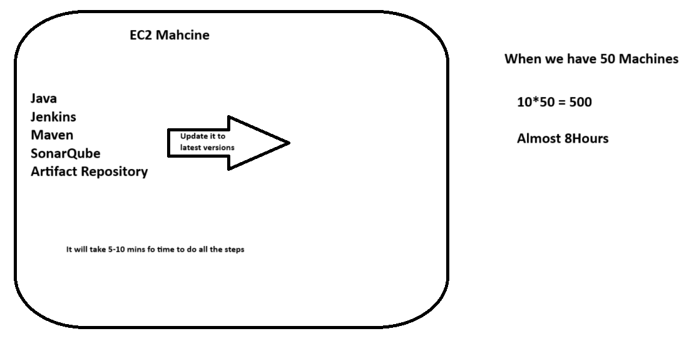

## Ansible Introduction

## Simple Scenario
- Lets Say we have an EC2 Machine and we have to deploy an application in that
- Before deoployment there is something that need to be done, i,e. we have to install some of the dependencies in that system
- Those dependencies need to updated regularly to avoid some of the threats from the cyber
- IT is recommeded to upgrade all the packages in the EC2 Machine to the latest versions


- It is not recommended to perform all those things manually as it is taking more time to peform a simple tasks
- Is there option to bypass these and do things ASAP?
- We have an tool called **Configuration Management Tool**

## Configuration Management Tool
- This tool will try to automate all the task what ever you are trying to do in manually
- We just need to provide what thing have to be done by giving it as instructions
- The rest will be taken care by the tool itself
- The CMT is of two types
    1. Pull Based Mechanism
        * You have to create automation code in one system and you have to install agents in all the other systems to use your code
        * You have to pull your code through the agen help and execute that code
        Ex: **Chef & Puppet**
    2. Push Based Mechanism
        * You have to create automation code in one system and then push your code to all the other systems with the help of agent installed only in one system
        * The agent itself will take care of executing your code in all the other systems automatically
        Ex: **Ansible**
        - This is the most popular and used by many organizations

- Ansbile will use **YAML** language to write our code
- To install ansible in our local system use the following command
```
choco install ansible -y
```


