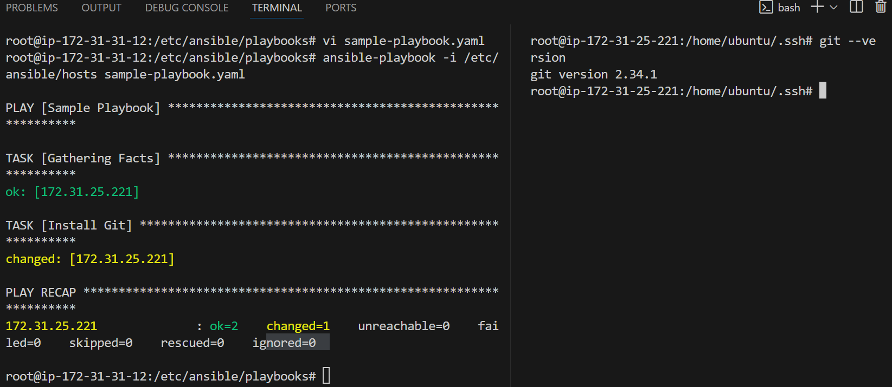

### Ansible Cont...

- To execute our playbooks we have to do some setup by creating 2/more servers and among those 1 server need to be make it as a Ansible controll Node
- The other servers will act as a Nodes
- Follow Class Recording to Create Machines
- After Successfully created 2 Server, connect to the servers and perform the following configuration

## Configuration Setup of Ansible Nodes
- In ACN we have to install Pyhthon & Ansible
- In Node we have to install Python

- We have to Copy SSH Keys in Nodes of ACN
- We have to setup Password less Authentication between ACN & Nodes
- Create a User/use Existing user to give root permissions

### Install Ansible
1. Update all the packges
2. Install Python on both the servers
```
apt install python3.11
```
3. Install ansible in ACN using this command 
```
sudo apt update
sudo apt install -y software-properties-common
sudo add-apt-repository --yes --update ppa:ansible/ansible
sudo apt update
sudo apt install -y ansible
```

### Copy SSH Keys 
1. Create SSH Keys in ACN & 
2. Then copy Public Key into **Authorized Keys** in the Node 

### Setup Passwordless Authentication
1. Go to this path `/etc/ssh`
2. Then Edit this file `vi sshd_config`
3. No modify the below code
```
# To disable tunneled clear text passwords, change to no here!
#PasswordAuthentication yes
#PermitEmptyPasswords no
```
as below
```
# To disable tunneled clear text passwords, change to no here!
PasswordAuthentication no
#PermitEmptyPasswords no
```
4. Save the file by using this `:wq`
5. Restart the ssh service using this command `service sshd restart`

### Create a User/use Existing user to give root permissions
1. Go to this file `visudo`
2. Where you have root previleges
```
# User privilege specification
root    ALL=(ALL:ALL) ALL
```
3. Add the below content
```
# User privilege specification
root    ALL=(ALL:ALL) ALL
ubuntu  ALL=(ALL:ALL) NOPASSWD:ALL
```
4. Save your file with below command
```
press ctrl+O
press Enter
press ctrl+x
```

### Check if the connection was established or not
- After doing all the above configuration if you were able to login into the system without any password, then our configuration was successfull
- To login from server to client type the following command
```
ssh ubunut@<ip-address>
```


### Ansible Playbook
- The default location of ansible after installation
```
/etc/ansible
root@ip-172-31-31-12:/etc/ansible# ls
ansible.cfg  hosts  roles
```
- Create a Folder inside of Ansible directory ```mkdir playbooks`
- Create a file with name `sample-playbook.yaml`
- Copy paste the content from [Here](https://github.com/abhi-yuva/Devops-Feb-2024/blob/main/Ansible/Playbooks/sample-playbook.yaml)
- After writing your Playbook to check if it is correct or not using this [Webiste](https://yamlchecker.com/)
- We have to edit our Host file
- Go to the path `/etc/ansible/`
- edit your host file `vi hosts`
- Add the client IP address inside of the hosts file
```
# Ex 1: Ungrouped hosts, specify before any group headers:

## green.example.com
## blue.example.com
## 192.168.100.1
## 192.168.100.10

172-31-25-221
```
- Save your file
- Now verify if you are able to ping your client or not from ACN
```
ansible all -i <path-to-hosts-file> -m ping
```
- When you get as below success message you are able to ping
```
root@ip-172-31-31-12:/etc/ansible/playbooks# ansible all -i /etc/ansible/hosts -m ping
172.31.25.221 | SUCCESS => {
    "ansible_facts": {
        "discovered_interpreter_python": "/usr/bin/python3"
    },
    "changed": false,
    "ping": "pong"
}
```
- To execute your ansible playbook use this command 
```
ansible-playbook -i hosts sample-playbook.yaml
```
- After executing your playbook you can able to see the below output as it was changed


```
PLAY [Sample Playbook] *********************************************************

TASK [Gathering Facts] *********************************************************
ok: [172.31.25.221]

TASK [Install Git] *************************************************************
changed: [172.31.25.221]

PLAY RECAP *********************************************************************
172.31.25.221              : ok=2    changed=1    unreachable=0    failed=0    skipped=0    rescued=0    ignored=0
```

**PLAY [Sample Playbook]** - Name of your Playbook
**TASK [Gathering Facts]** - Connecting with the Host Details
**TASK [Install Git]** - Taks Name
**changed: [172.31.25.221]** - Changed means it was not installed earlier if we get as changed means it was installed properly now
**changed=1** - How many Tasks were executed