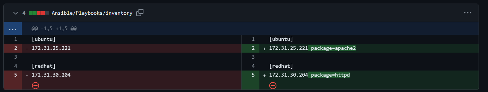

## Ansible cont...

- Execute our Playbook with the OS specified
- Below command we will use to execute our playbook
```
ansible-playbook -i <inventory-path> <playbook-name>
```
- After executing our playbook the sample output will look like this
```
root@ip-172-31-31-12:/etc/ansible/playbooks# ansible-playbook -i /etc/ansible/inven playbook-os.yaml --check

PLAY [Sample Playbook] *********************************************************

TASK [Gathering Facts] *********************************************************
ok: [172.31.30.204]
ok: [172.31.25.221]

TASK [Install Git] *************************************************************
skipping: [172.31.30.204]
ok: [172.31.25.221]

TASK [Install Nginx] ***********************************************************
skipping: [172.31.30.204]
changed: [172.31.25.221]

TASK [Install Git] *************************************************************
skipping: [172.31.25.221]
changed: [172.31.30.204]

PLAY RECAP *********************************************************************
172.31.25.221              : ok=3    changed=1    unreachable=0    failed=0    skipped=1    rescued=0    ignored=0      
172.31.30.204              : ok=2    changed=1    unreachable=0    failed=0    skipped=2    rescued=0    ignored=0      

```
- Instead of specifying the different packages for different flavours of OS we have a module called **Package** which is global to all the flavours of OS
- See the [Official Documentation](https://docs.ansible.com/ansible/latest/collections/ansible/builtin/package_module.html) for reference

### Install Apache in Both the OS flavours
- Follow this [Playbook](https://github.com/abhi-yuva/Devops-Feb-2024/blob/main/Ansible/Playbooks/install-apache.yaml)for installing Apache
- After executing our playbook it will look like this
```
root@ip-172-31-31-12:/etc/ansible/playbooks# ansible-playbook -i /etc/ansible/inven install-apache.yaml

PLAY [Sample Playbook] *********************************************************

TASK [Gathering Facts] *********************************************************
ok: [172.31.30.204]
ok: [172.31.25.221]

TASK [Install Apache] **********************************************************
skipping: [172.31.30.204]
ok: [172.31.25.221]

TASK [Enable & Start] **********************************************************
skipping: [172.31.30.204]
ok: [172.31.25.221]

TASK [Install Apache] **********************************************************
skipping: [172.31.25.221]
changed: [172.31.30.204]

TASK [Enable & Start] **********************************************************
skipping: [172.31.25.221]
changed: [172.31.30.204]

PLAY RECAP *********************************************************************
172.31.25.221              : ok=3    changed=0    unreachable=0    failed=0    skipped=2    rescued=0    ignored=0      
172.31.30.204              : ok=3    changed=2    unreachable=0    failed=0    skipped=2    rescued=0    ignored=0
```
- Instead of duplicating all the packages in different OS we have a concept called **Group Vars**
- This we will do it in Inventory levle
- Follow the changes in inventory file

- Look for the change in the Playbook


- Now instead of specifying our package manage differently in different flavours we can specify the global one **Package** Module
- See this [Official Documentation](https://docs.ansible.com/ansible/latest/collections/ansible/builtin/package_module.html) for Package Module
- Make the change in our playbook
- Here are the changes

