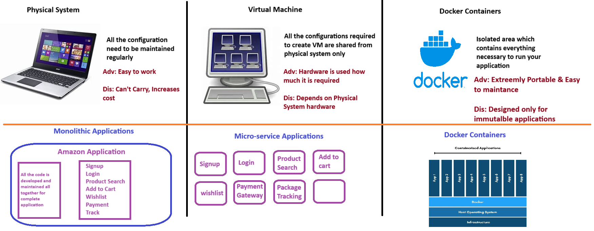

## Docker Introduction
- Go through class video for scenario of different type of Machines
- Here is sample image to show the differences

## How docker works
- We have 2 things
    1. Docker Client
    2. Docker Server
- **Docker client** will communicate with the user to run the commands.
- **Docker Server** will communicate with the Kernel to create the containers/resources
- To create containers we need to write **Docker File**
- With the help of docker file we have to create a **Docker Image**, and that image can be used to create **Containers**
- Once the image is created, we can store that image either in Official Docker Hub Repository or your own Repositories
- We can pull that image and container can be created.