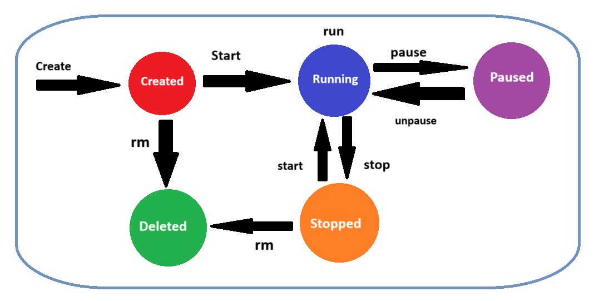
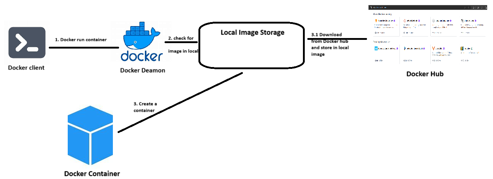

### Docker Cont...

## What is the life cycle of Docker
- As soon as you create a container it's state will be in 4 stages
    1. **Created** - Use `create` command and it will just create the container and it will not run it
    2. **Running** - From created state you can use `run` to run your container
    3. **Paused** - You can pause and un-pause the containers
    4. **Stopped** - Use `stop` command to stop the running containers & Use `start` command to run your conatiner
    5. **Deleted** - Use `rm` command to delete the containers

## How Docker Works
- To create a container we need image.
- Intially when you run `docker container run` docker deamon will checkfor the image locally and if it exist then creates container
- If it is not exist it will try to download it from the `docker hub` and will store it in local storage
- Then from the local stroage it will create a container

- [Official Docker Hub](https://hub.docker.com/) where all the images as stored

## How Docker can be practiced
- We can do in 2 ways
    1. Install docker in our local system and then practice
    2. Labs which is given by Docker also we can try

- Excersice for you
    - Go and create an account in [Docker Labs](https://labs.play-with-docker.com/)
    