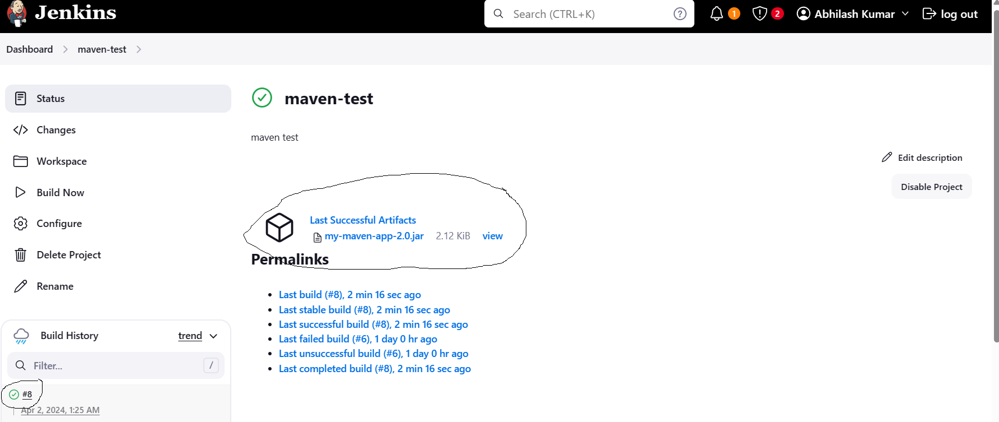

## Maven Cont...

- When ever you create a jar/war file in jenkins it will not be shown automatically in jenkins console.

- After building you have to go and check in the server
- It is not possible all the time to check in that manner. We have an option to publish our packages in jenkins
- In post build actions we have to specify the artifacts. Refere the below image 

- After publishing the artifacts you can able to see the artifacts in jenkins console itself

### Publish Test Results
- Once your build is completed you have to test your code and you have to publish your test results.
- From Maven we have an options called `mvn test` which will perform unit test cases
- Test results will also be stored inside of target folder but it will create an another folder inside of target folder i.e, `surefire-reports`
- Inside of this reports folder it will create a `xml` file the naming convention for that will be as `TEST-<project-name>.xml`

### Create Jenkinsfile for build operations
- As of now we are performing it from freestyle project
- It is recommended to do it through the pipeline
- See [Here](https://github.com/abhi-yuva/my-maven-repo/commit/d67401eee946dd30939f896224435721a9ed774c) for the latest changes
- Now try to create a pipeline in jenkins for build
- Once your build is completed you can able to see the results
