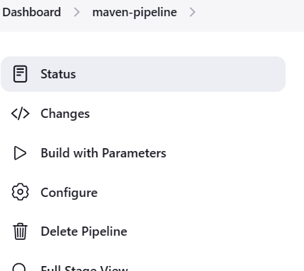

## Jenkins Cont...

### Parameters in Jenkins
- Basically you will have some options to perform your tasks in multiple environment
- Lets say you have 4 environment
    * Dev
    * Uat
    * Stg
    * Prod
- You have to perform your actions according to your environment
- In that case, jenkins has an option called parameters to choose which option you want to execute from your pipeline
- To specify the parameters you have two options.
    1. From jenkins Console
    2. From Jenkinsfile
- [See here](https://github.com/abhi-yuva/my-maven-repo/commit/db42cf12b73f18069707068a9a41e9ba628486e0), how to add parameters in your Jenkinsfile
- Then after adding your parameters to refelct those in our jenkins pipeline, you have to choose an option in configuration in pipeline `this project is parameterized`
- Once you check that option, you have to build your job once so that the parameters will reflect in your pipeline

- Then after clicking on save, you can able to see your pipeline will have option as `Build with Parameters`


- Now to run your job with options click on that `Build with Parameters` then it will ask you to choose the parameter to run
- Choose option and click on `Build`
- Inside of console you can able to see in which evironment you are running your job


### How to add Time out & Approval message in Jenkins
- We need to add approvals for some of your critical tasks to not mesh with any issues further
- To add approvals you have give the following message inside of your pipeline
```
input message: "Approve this pipeline to deploy", ok: 'Yes'
```
- This input will ask the user to choose to proceed or stops
- If you want to keep any time out for your approval you have to give like below
```
timeout(time: 5, unit:"HOURS")
```
- The input message should be inside of timeout to take approval
```
timeout(time: 5, unit:"HOURS"){
    input message: "Approve this pipeline to deploy", ok: 'Yes'
}
```
- After that once you run your pipeline you can able to see the option for approval inside of your console output

