## jenkins Introduction:

### Why do we need Jenkins:
### Manu Apporach of Software Development
- Develop the Code
- Testing
- Deploy

### What is the best approach for that
- We have to integrate our code on daily basis so that we wont get any conflicts after development
- Here, as soon as the developer developes the code immediately the code will be passed to the testing team to test it
- On daily basis if you are doing this, then time taking for development of your application will reduce as well as, you will get the effective application with out any issues.
- Even, when testers are working together with the developers most of the bugs and issues from the application end can be rectified.

### Continuous Integration
- When do we need this integration approach
    1. When mulltiple developers are working on same application, we have to integrate all the developers code in once place
    2. when you are performing any enhancements in your code or if you are maintaining any code quality
    3. When you are trying to resolve any bugs
    4. When you need to upgrade or downgrade your softwared needed for your application support
    5. 

- Next we have to build the code and then deploy the code in any of the servers.
- Steps we follow here 
    - Build the Code
    - Store that package in any of the artifactory 
    - Create / configure your Servers
    - Deploy your Code
- All the above steps if you are performing manally it is not as easy as expected
- Instead of doing all these manually we can process these steps into automation
- The automation process we call it as **Continuous Deployment & Continuous Delivery**

- This automation in short form we call it as **CI/CD** 

## Which tool supports the above process.
- There are multiple tools wich supports automation in market
- The major tools are as below
    1. **Jenkins**
    2. **Azure Pipelines**
    3. **Bitbucket pipelines**
    4. **Code Pipeline**

- **jenkins is used to automate your manual tasks in the process of software development**

## Pre-re for using Jenkins
- We need an Server(Linux/Windows) to Maintain jenkins
- We need to install Java in servers
- We will install Jenkins

### To create a Server
- We need on platform where we can use to maintian jenkins
- We will be using AWS as Cloud Platform
- We need to create AWS Account

### Steps to Create AWS Account
1. Go to this [Link](https://portal.aws.amazon.com/billing/signup#/start/email) to create AWS Account
2. You will get the signup page 
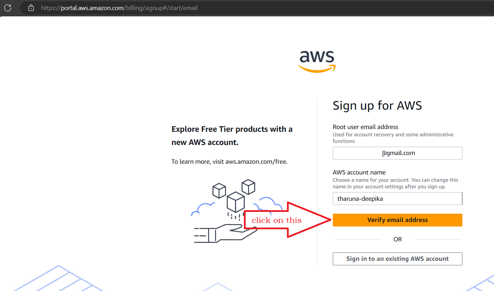
3. Follow the below pictures to create AWS Account
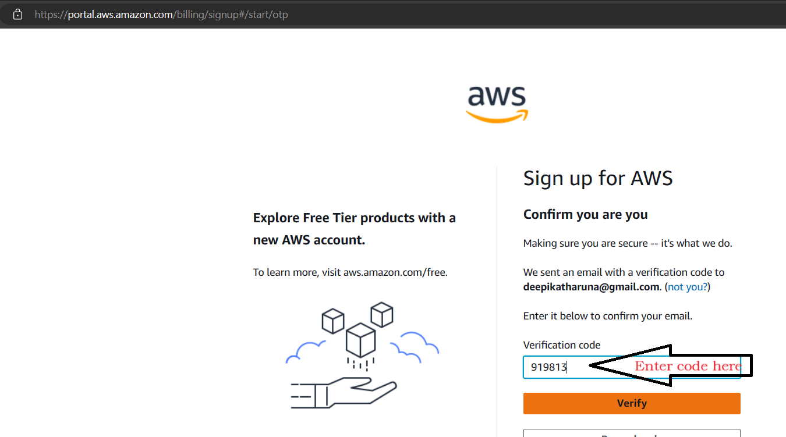
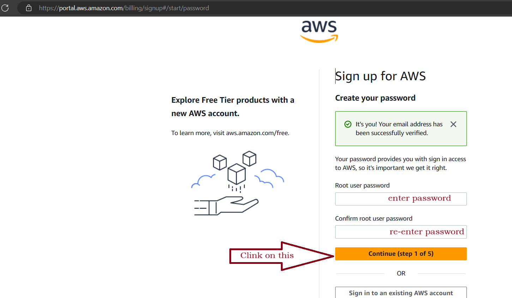
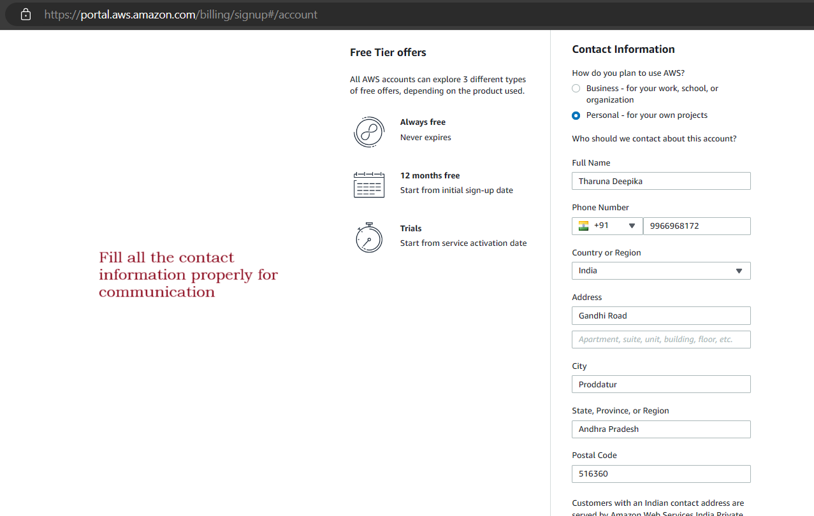
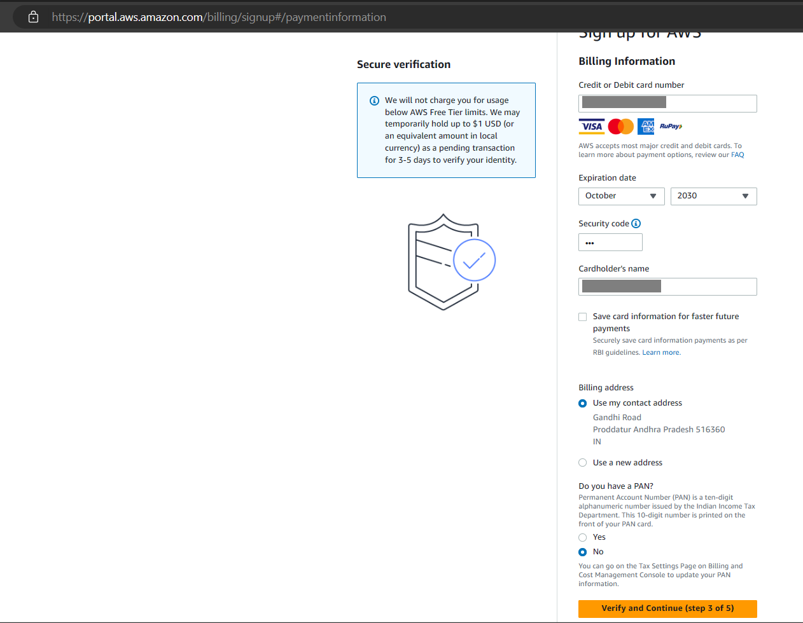
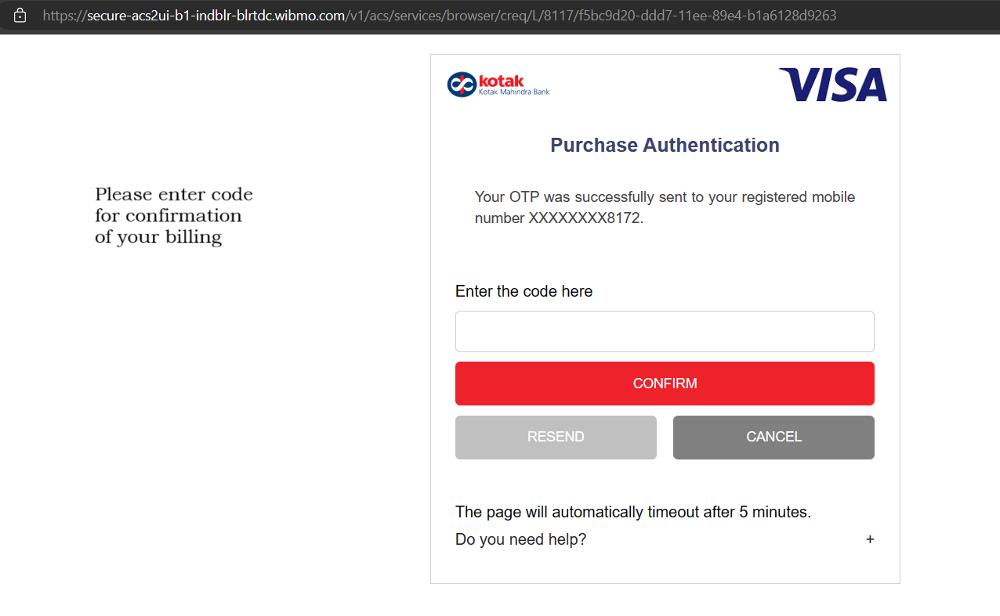

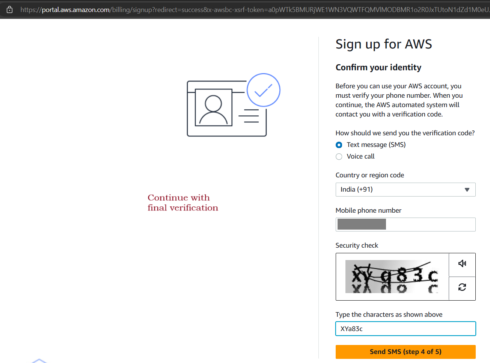
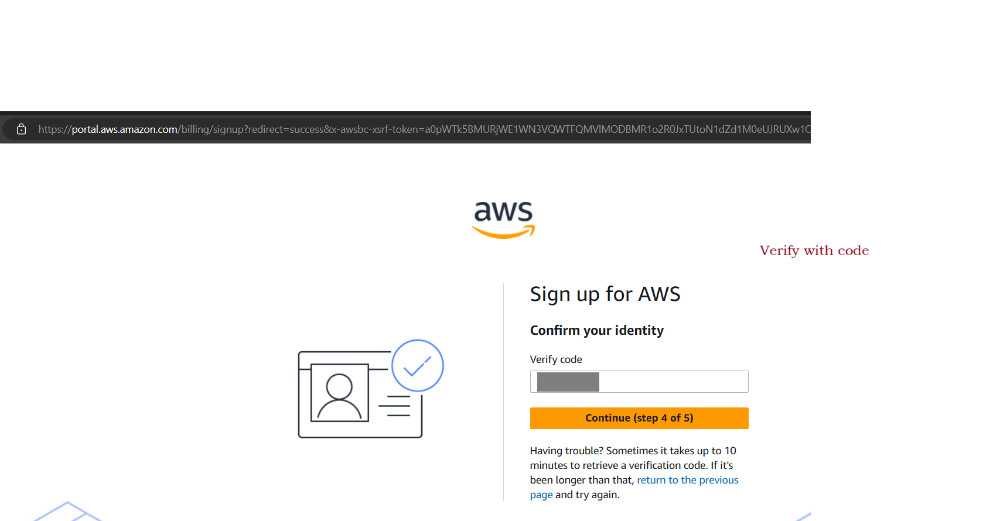
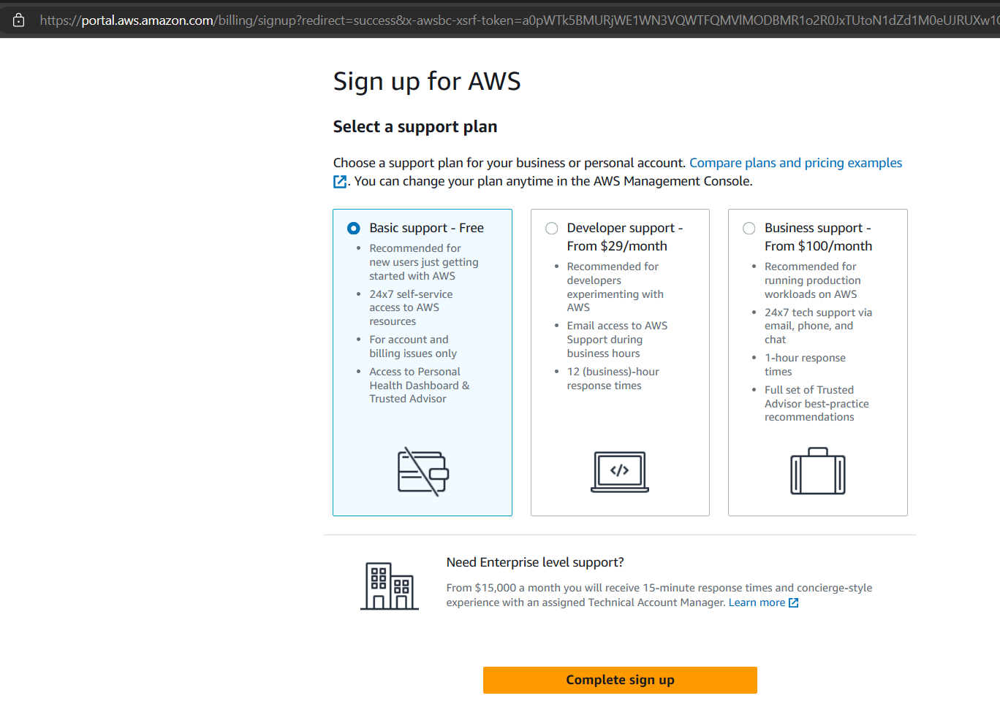
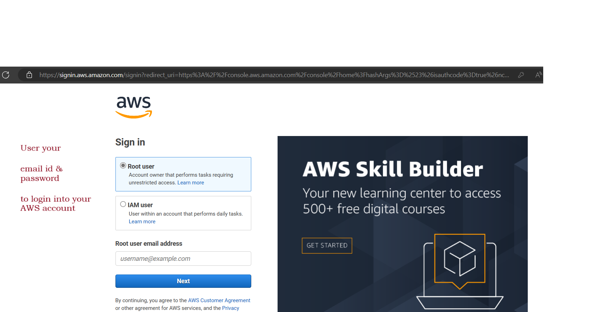
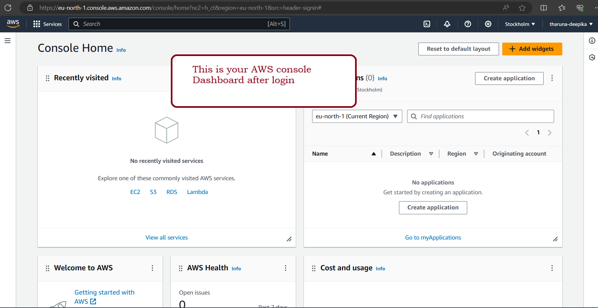

2. Go to this [Link](https://signin.aws.amazon.com/signin?redirect_uri=https%3A%2F%2Fconsole.aws.amazon.com%2Fconsole%2Fhome%3FhashArgs%3D%2523%26isauthcode%3Dtrue%26nc2%3Dh_ct%26src%3Dheader-signin%26state%3DhashArgsFromTB_eu-north-1_7aaf595ff8d8cba7&client_id=arn%3Aaws%3Asignin%3A%3A%3Aconsole%2Fcanvas&forceMobileApp=0&code_challenge=VSRzcm9iMZXdBNYQnfnkLZZSkBRP3HrR5kQUJftN-Fo&code_challenge_method=SHA-256) to login into your AWS Account
