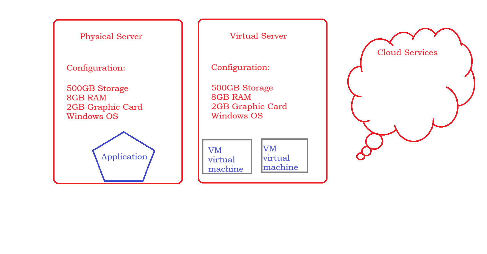

### Requirement to Create a Server
- The requirement we simply call it as configuration of your server
    1. RAM
    2. Storage
    3. Capacity (CPU)
    4. Performance
    5. OS
    6. Security

### Replication of the Physical Sever in AWS
- If we compare the Physical server with the Cloud Services
| Physical | Cloud|
| ---- | ---- |
| Server/Laptop/System | EC2 (Elastic Cloud Compute) |
| Security | VPC/Security Groups |
| Storage | Volumes |
| OS (Operating System) | AMI(Amazon Machine Image) |
| RAM & Capacity | core-cpu |
| ---- | ----| 

### Be Ready with these Before Creating of you Cloud Servers
- These are the below things you need to keep in mind before creating your servers
    1. **Virtual Private Cloud (VPC)** - Which is used to controll the access levels of your server. You will be creating a range of CIDR blocks. By default every one will have one VPC provided by the AWS. 
    2. **Security Group (SG)** - Which is used to controll your traffic that is allowed to reach and leave the resources that are associated in your AWS
    3. **Amazon Machine Image (AMI)** - AMI is nothing but different flavours of OS. AMI will maintaine multiple categories of OS. It is used to create EC2 machines in your AWS.
        ```
        Example
        
        Windows: Windows10, Windows11...
        Linux: Ubuntu, Redhat, CentOS...
        ```
    4. **Elastic Compute Cloud(EC2)** -  It is a cloud based web service that is use to create your server which can be more secure, resizable and can be maintainable.
    
    - Here is the sample example of need of cloud services instead of physical
    