### How to Create an EC2 Machine
- Follow the below steps to create an EC2 Machine

1. From AWS console follow the below steps
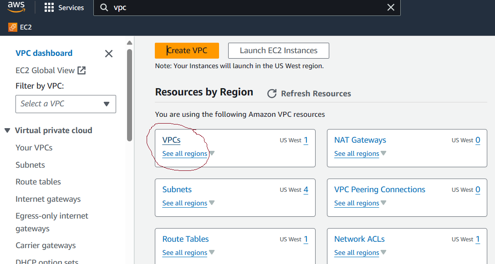

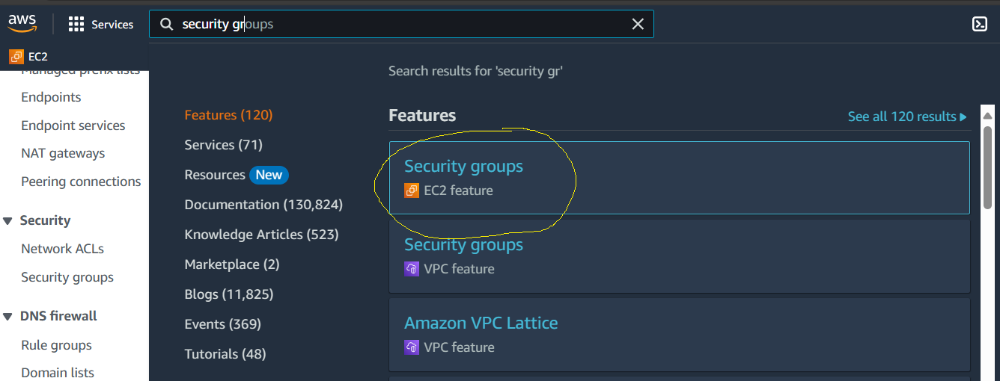

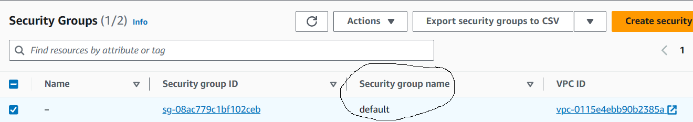

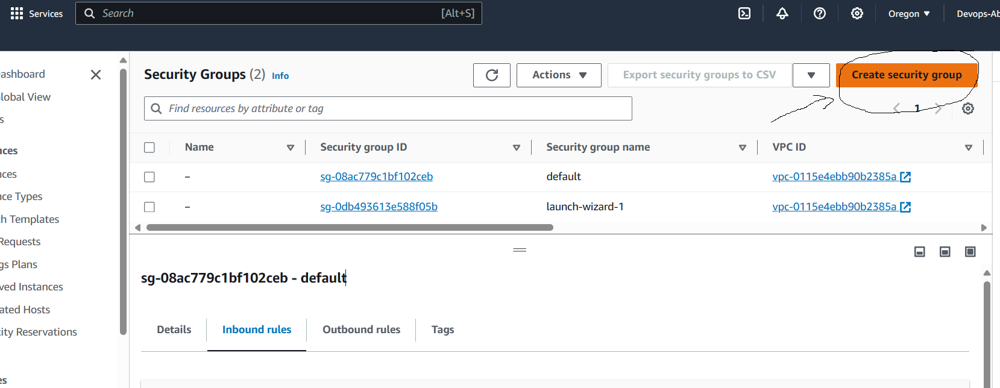

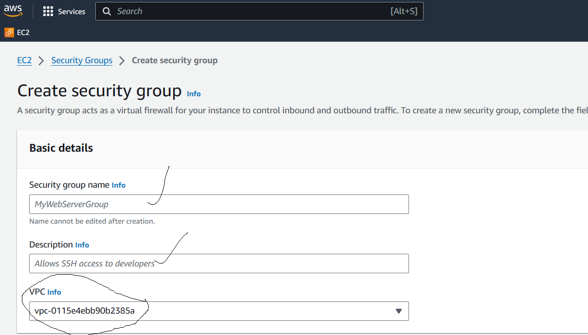

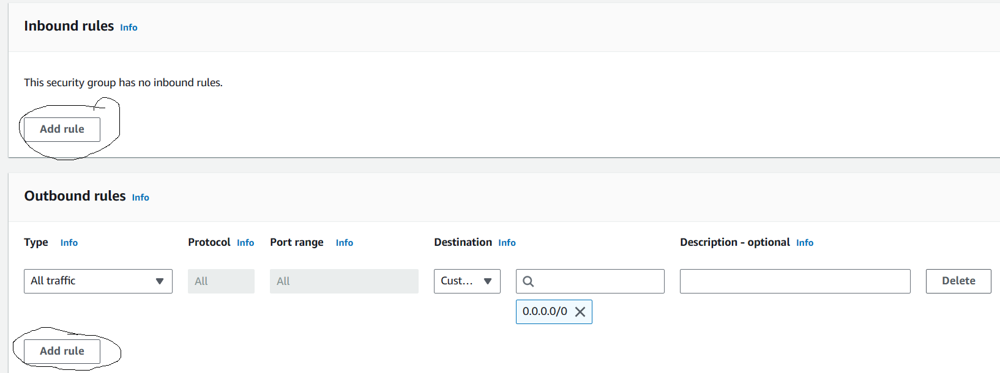

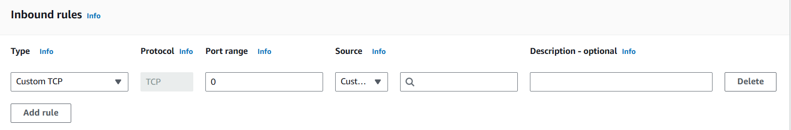

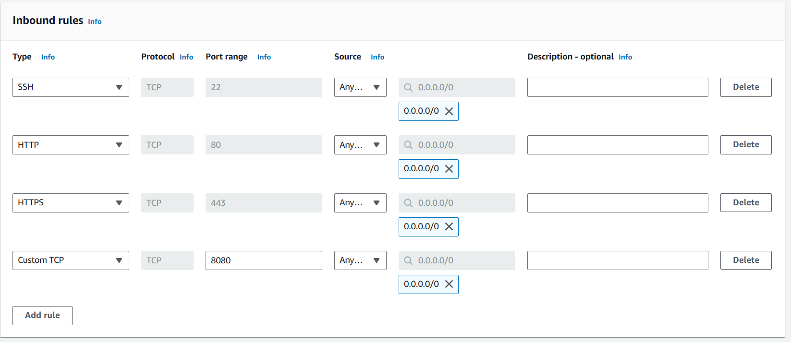

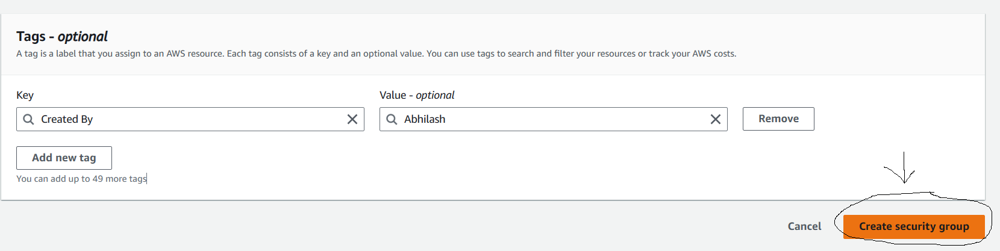

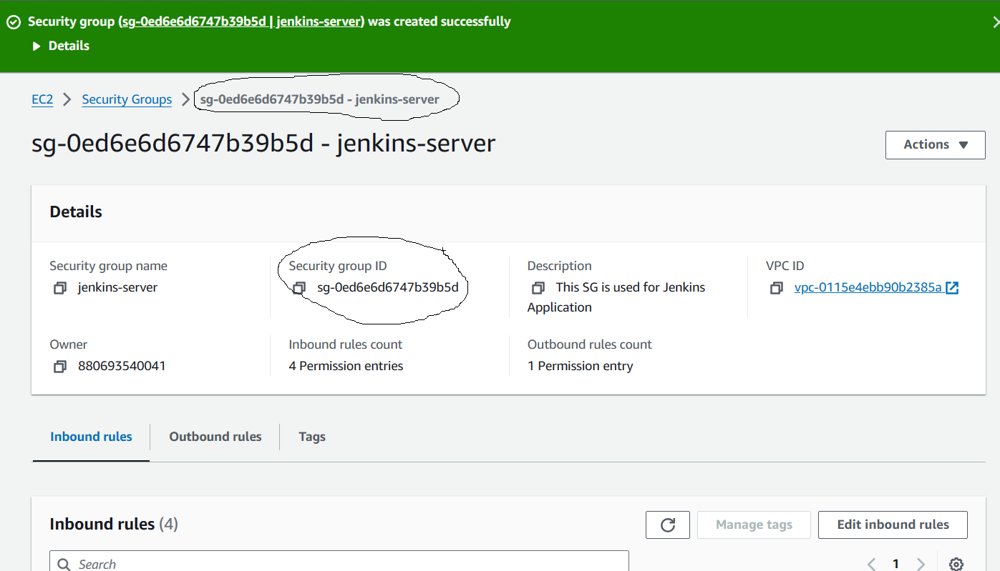

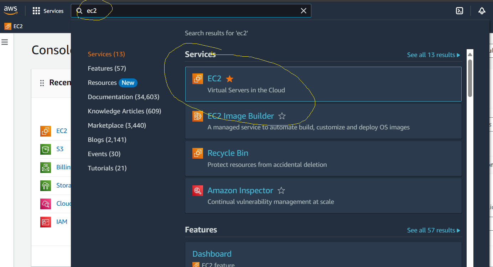

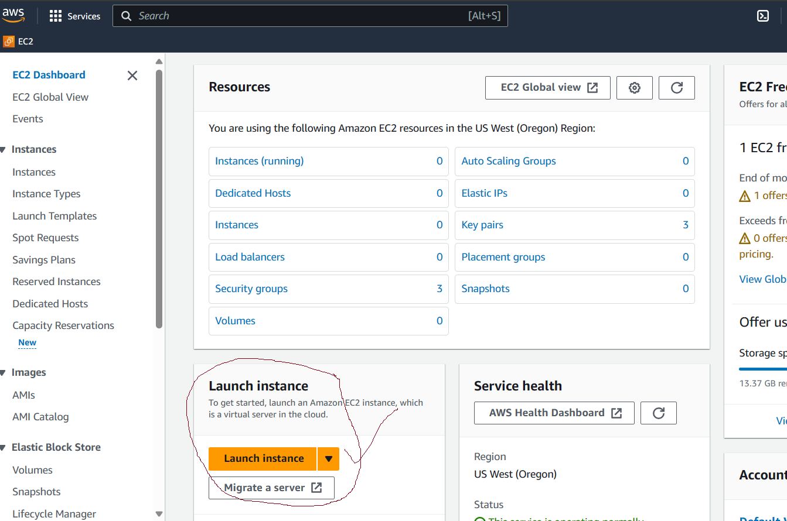

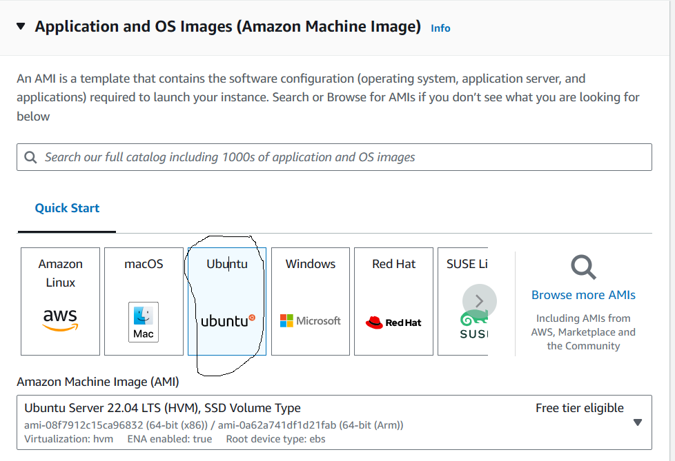

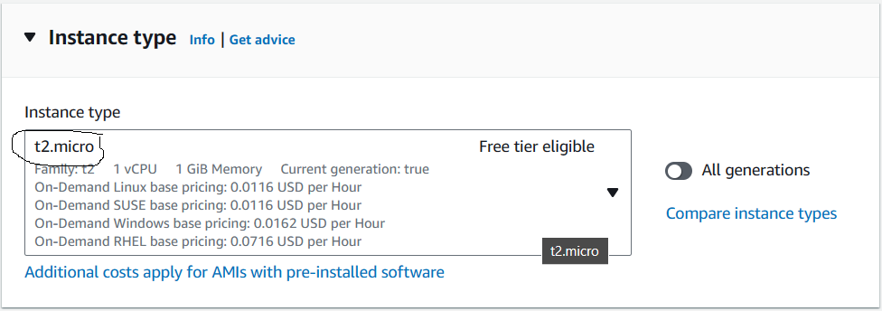

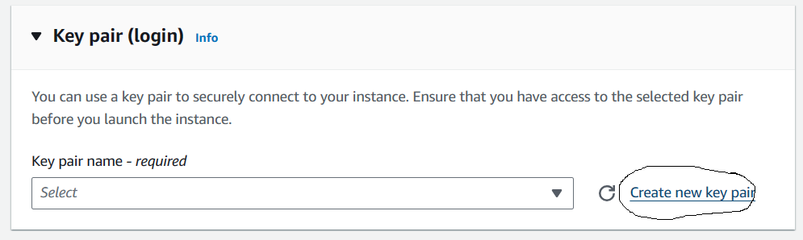

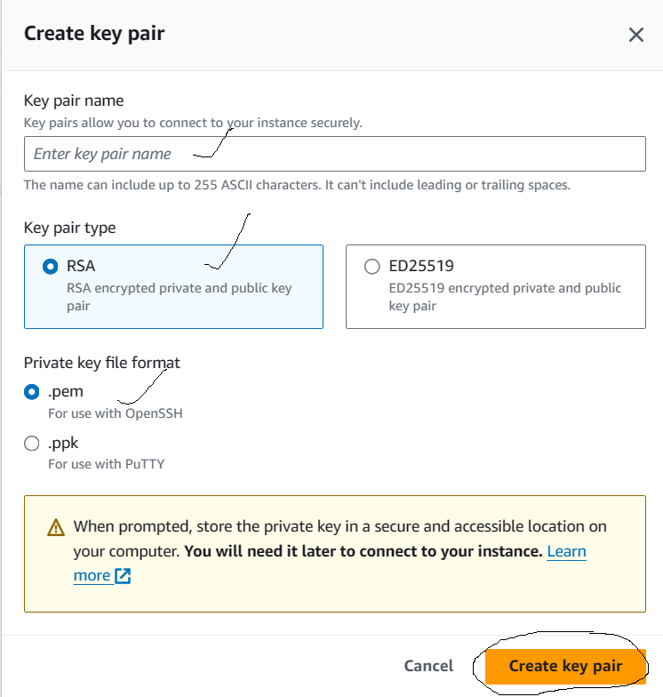

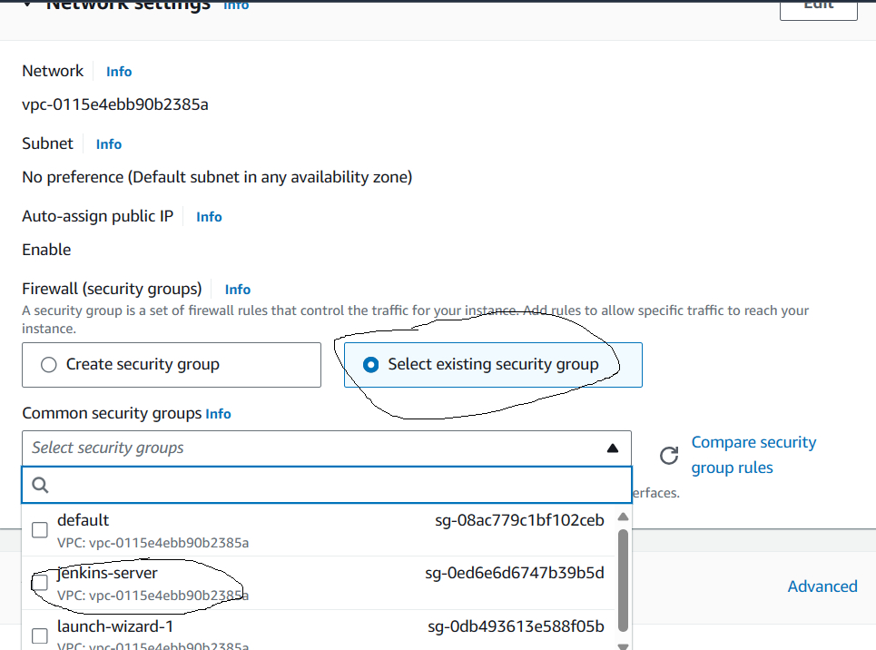

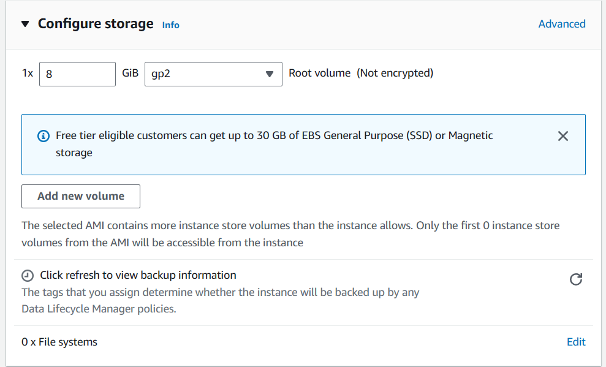

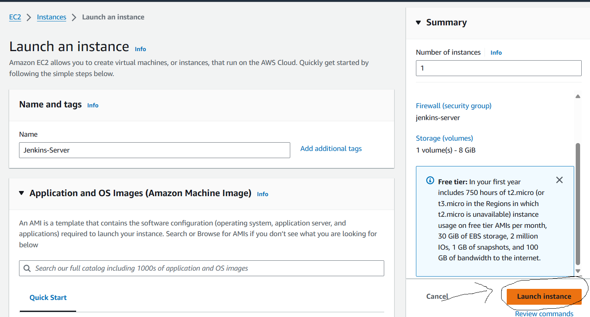

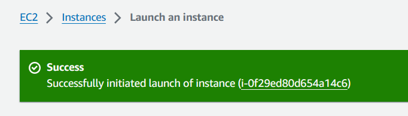

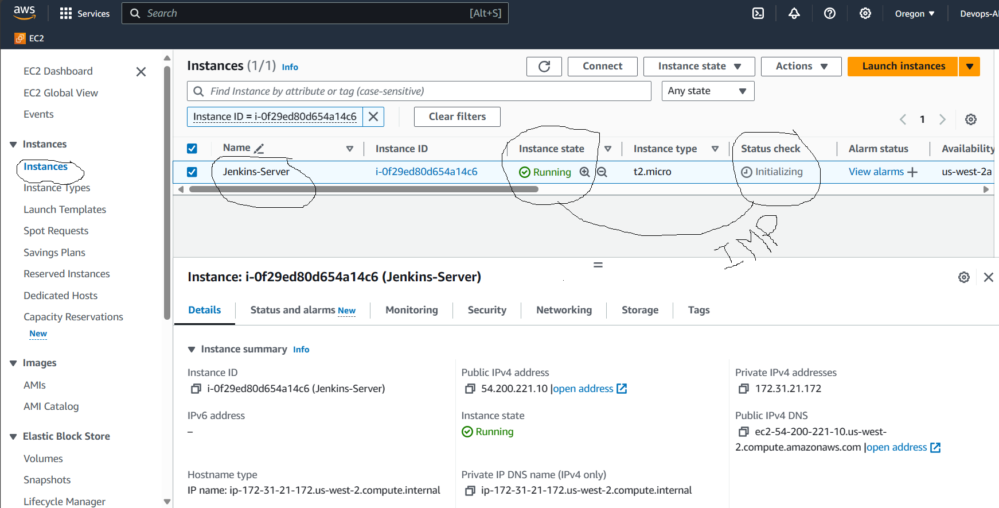

- [Click here](https://www.geeksforgeeks.org/50-common-ports-you-should-know/) to see the Default ports of some of the protocals