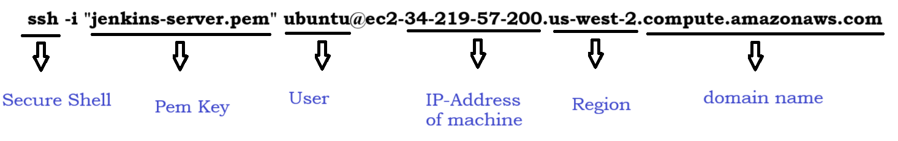

### How to Create SSH Keys in your Local System
- SSH is nothing but **Secure Shell**
- To create SSH keys, first open your GIT in your terminal or CMD
- Then type the below command
```
ssh-keygen
```


- Press **Enter** to save in the default location
- Then it will ask you to enter the password, dont give any password press **Enter** directly
- Then it will ask you to re-enter the password, dont give any password press **Enter** again
- Then it will create a folder in your local system with the name as **.SSH**
- The default location will be this one
```
/c/Users/<user-name>/.ssh
```


- If we go inside of the folder we will have 3 files
    1. **id_rsa** - Private Key
    2. **id_rsa.pub** - Public Key
    3. **know-hosts** - List of hosts details wich are connected to through ssh


### How to install Jenkins
- First you have to start instance, to start instance select instance>>instace state>>**Start Instance**

- Now you have to connect to your instance.

- Copy the ssh connection and then open your terminal where your **pem keys** exist




- Copy and paste the SSH command in your terminal and press enter
- It will prompt you to type **YES** type it and then press enter
- If you were able to see the below image means you are loggedin to the system


- To install Jenkins Follow the [Official Link](https://www.jenkins.io/doc/book/installing/)
- Be as a root user when ever you want to perform any actions. To switch to Root user type the below command
```
ubuntu@ip-172-31-21-172:~$ sudo su
root@ip-172-31-21-172:/home/ubuntu# 
```
- Before installatin of Jenkins you need to install Java
- Follow the below commands to install 
```
 apt update
 apt install openjdk-17-jdk
 java --version   --> this is to check if jave is installed or not

 wget -O /usr/share/keyrings/jenkins-keyring.asc \
  https://pkg.jenkins.io/debian-stable/jenkins.io-2023.key
 echo deb [signed-by=/usr/share/keyrings/jenkins-keyring.asc] \
  https://pkg.jenkins.io/debian-stable binary/ | sudo tee \
  /etc/apt/sources.list.d/jenkins.list > /dev/null
 apt-get update
 apt-get install jenkins
 jenkins --version
```


- To access your Jenkins you have to follow the below command
```
<public-ip-of-instance>:8080
Ex:
192.168.0.2:8080
```
- To the get InitialAdminPassword type the below command
```
cat /var/lib/jenkins/secrets/initialAdminPassword
```


- The default Location of jenkins is


