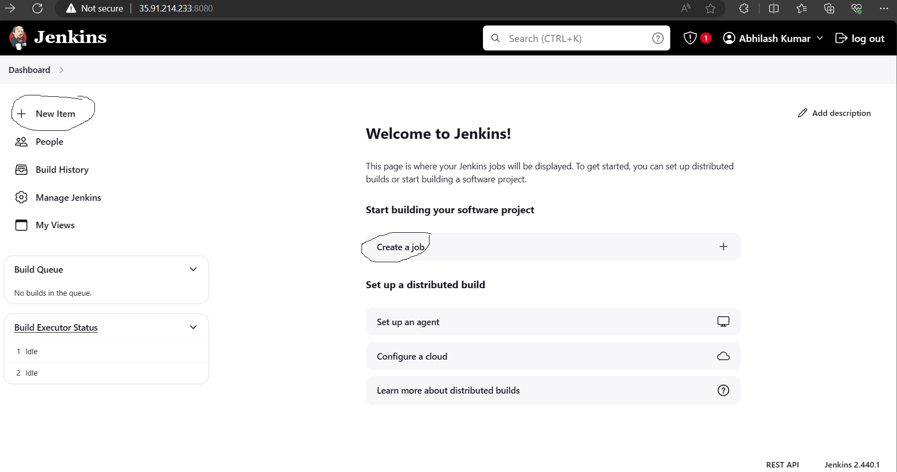
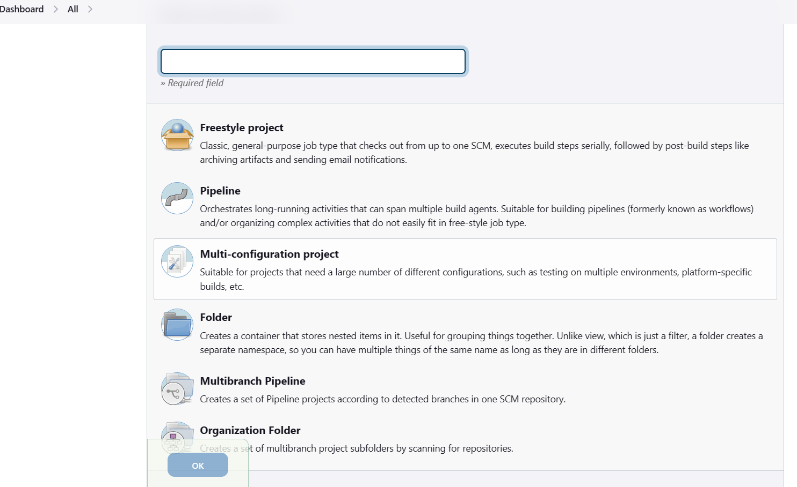
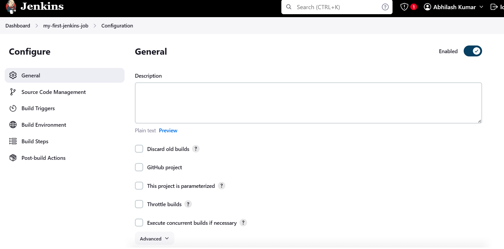
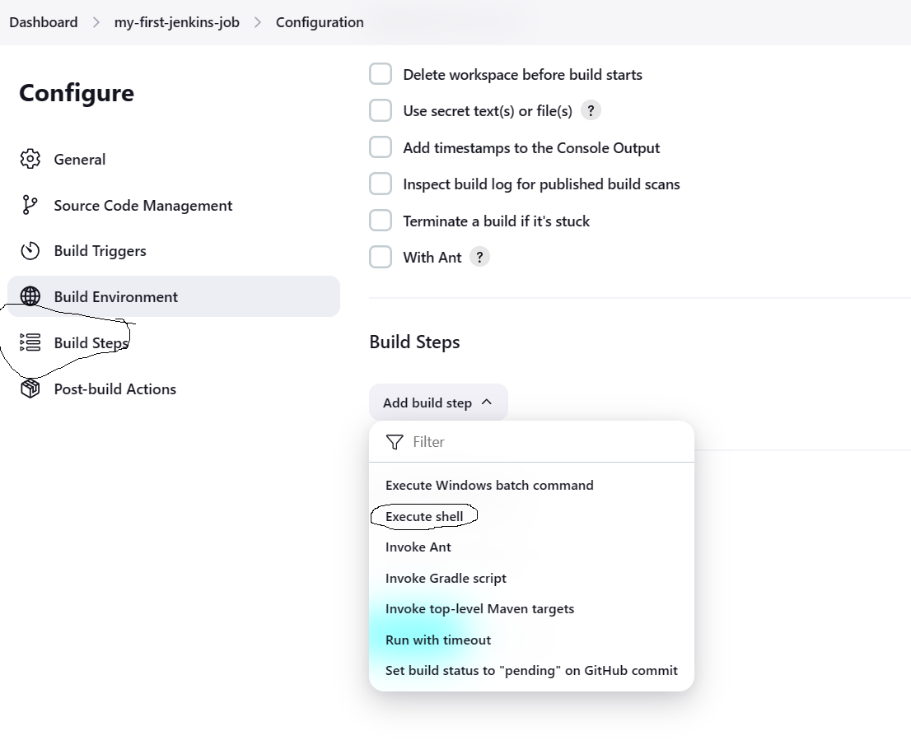
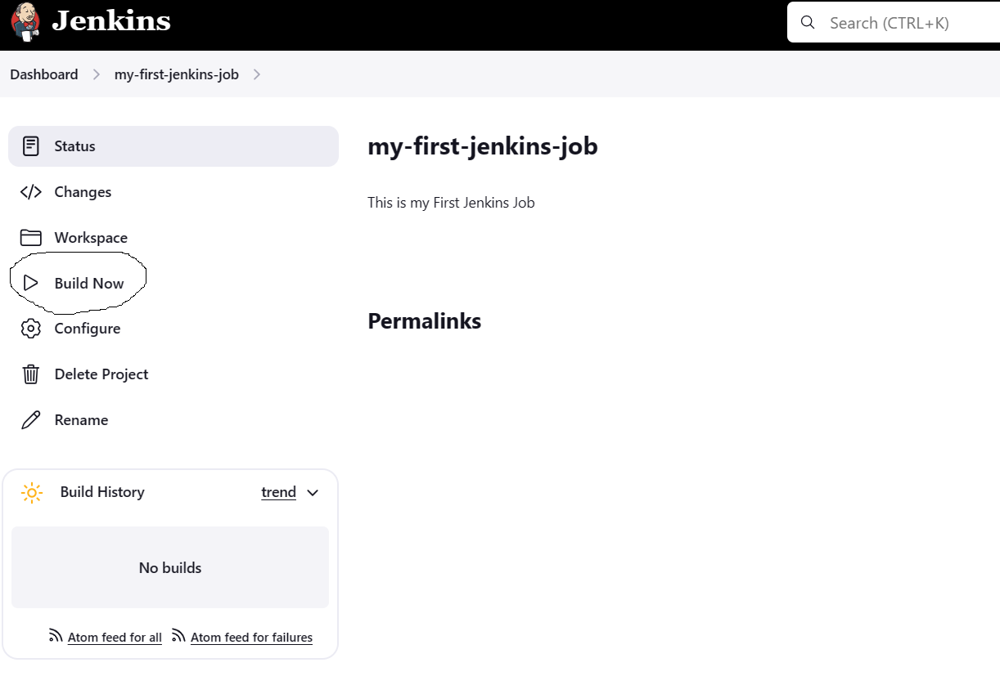
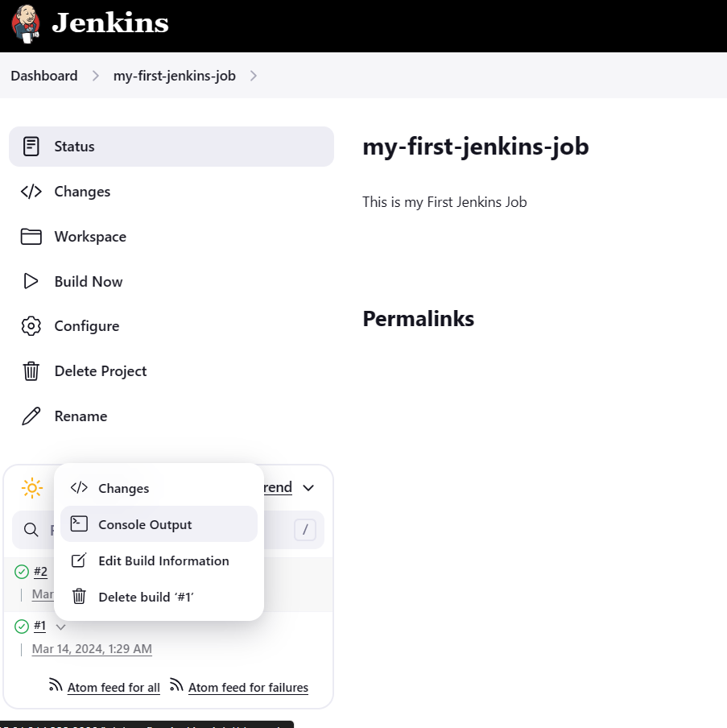
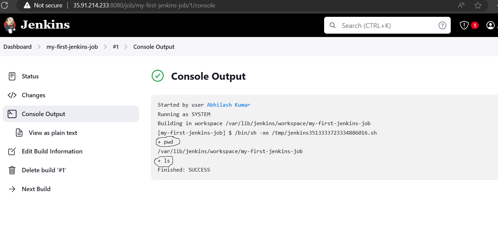

### Terms in jenkins
* **Job** : Job is nothing but a set of sequence of steps which is configured to perform one task in automation.
* **Workspace** : This is the place where all the data related to our Jobs is stored
* **Pipeline** : This is the automation task with the creation of manual steps
* **Jenkins Home** : This is the default location of Jenkins `/var/lib/jenkins/`

### How to Create a New Job in Jenkins
- To create a New Job from dashboard select **New Item** then, you will be redirected to select what kind of job you want to create.



- Then you have to choose which project you want. There different options available to create a Job in Jenkins
    1. Freestyle Job
    2. Pipeline
    3. Multi-branch Pipeline

### How to Create Freestyle Job
- From dashboard click on New Item
- Give the name of the Job, then select **Freestyle Job**


- Then it will open Configuration Dashboard directly


- Here you have to choose **Execute Shell** under **build steps**


- Then type the below command & Click on Save
```
pwd
ls
```
- Now Click on Buil Now


- After that Job will be executed. To see output from Down Arrow click on **Console Outpu**


- You can able to see the outpu of your job execution
