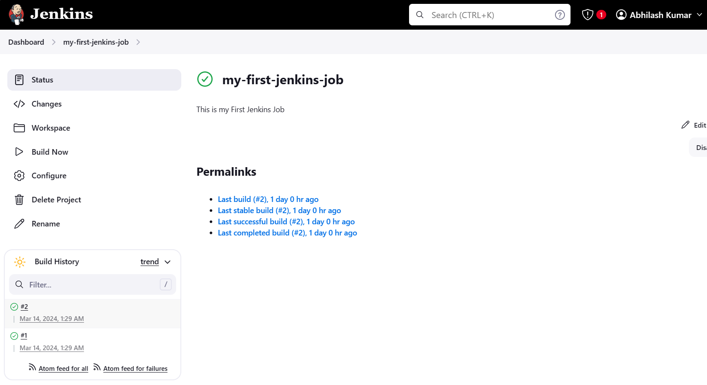
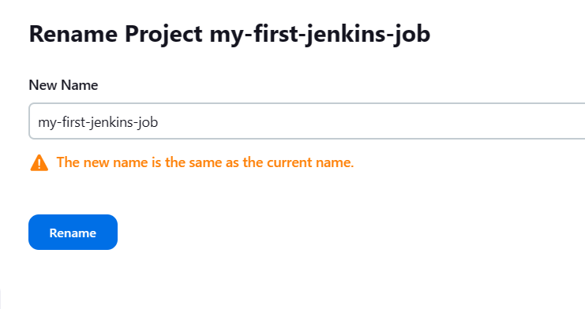
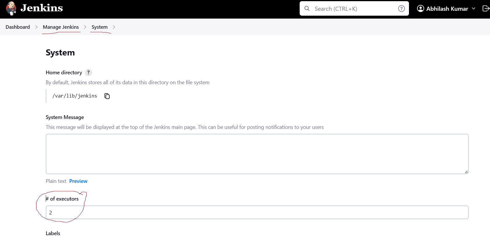
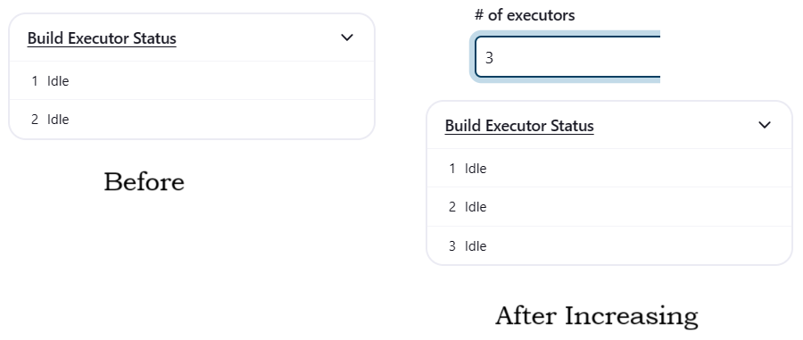

### Jenkins Cont...

- Once you click on the job, it will show you the below one


- For every job, a new workspcae will be created under jobs in the default folder of jenkins
```
/var/lib/jenkins/jobs/<workspace-name>
```
- Inside of every workspace we have the following data
```
root@ip-172-31-21-172:/var/lib/jenkins/jobs/my-first-jenkins-job# ls
builds  config.xml  nextBuildNumber
```
- **Builds** - Builds are those which are already executed in your jenkins workspace. It will contain all the list of build it executed. Untill you choose option of **discard old builds** to  remove builds before execution from configuration. <br>

    * Contents inside of the builds
    ```
    root@ip-172-31-21-172:/var/lib/jenkins/jobs/my-first-jenkins-job/builds# ls
    1  2  legacyIds  permalinks
    ```
    - 1 & 2 ... are the build numbers
    - legacyIds - id related to the builds
    - permalinks - It will show you how many builds are successful, failure, stable & unstable with count

- **config.xml** - This config.xml will contain exactly what you have configured from your Jenkins Console
Each and every information and options you choose in your jenkins job is a copy of this config.xml file. If you wish you can modify it from this file also, but it is not recommended.
Let's see what we have inside of config.xml file
```
root@ip-172-31-21-172:/var/lib/jenkins/jobs/my-first-jenkins-job# cat config.xml
<?xml version='1.1' encoding='UTF-8'?>
<project>
  <actions/>
  <description>This is my First Jenkins Job</description>
  <keepDependencies>false</keepDependencies>
  <properties/>
  <scm class="hudson.scm.NullSCM"/>
  <canRoam>true</canRoam>
  <disabled>false</disabled>
  <blockBuildWhenDownstreamBuilding>false</blockBuildWhenDownstreamBuilding>
  <blockBuildWhenUpstreamBuilding>false</blockBuildWhenUpstreamBuilding>
  <triggers/>
  <concurrentBuild>false</concurrentBuild>
  <builders>
    <hudson.tasks.Shell>
      <command>pwd
ls</command>
      <configuredLocalRules/>
    </hudson.tasks.Shell>
  </builders>
  <publishers/>
  <buildWrappers/>
```
- **nextBuildNumber** - This file will contiain the number of the next execution. It will be a sequence of number counted accordingly.

- Contents inside of Jenkins Job from console. Below is the image which shows all the contents.


- **Status** - Will give the latest details of your jenkins job alogn with the staus of your job(success/failure). It will also have an option of disabling/enablig your jenkins job
- **Changes** - If you have any changes WRT your build details, that will be stored over here
- **Wordspace** - It will show you the contents of your workspace
- **Build Now** - This is to execute your job
- **Configure** - If you want to make any changes or configure your Jenkins Job we can edit in this place
- **Delete Project** - If you want to delete your project use this
- **Rename** - If you want to rename, you can use this option
 

- **Build Executore Status** - This is how many build can be executed at a time? By default it will have 2 executors, if we want we can increase this as well.
    - to increase it Go to **Dashboard** >> **Manage Jenkins** >> **System**
    - Under **# of executors** increase the no and save it<br>
    

    
- **Build Queue** - It will have how many job are in queue which are waiting for executors.
