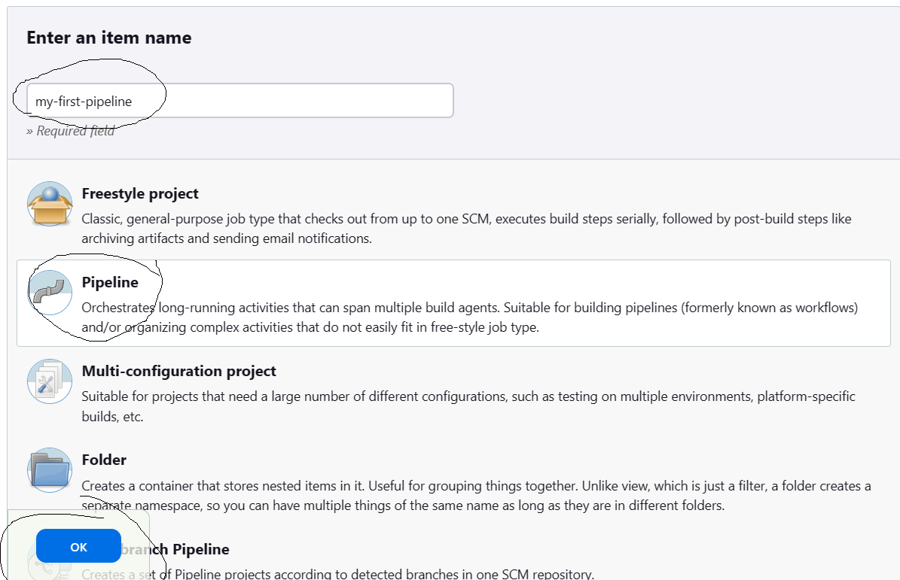

## Jenkins Cont ...

### How to create a Pipeline In Jenkins
- To create a piepeline from dashboard please click on **New Item**
- Then choose the pipeline option from the list
- Give the name of the pipeline & then click on OK
- Then configuration page will open proceed with the following details

    1. Here you will have 2 options in Pipeline
        * Pipeline Script
        * Pipeline Script from SCM (Source Code Management)