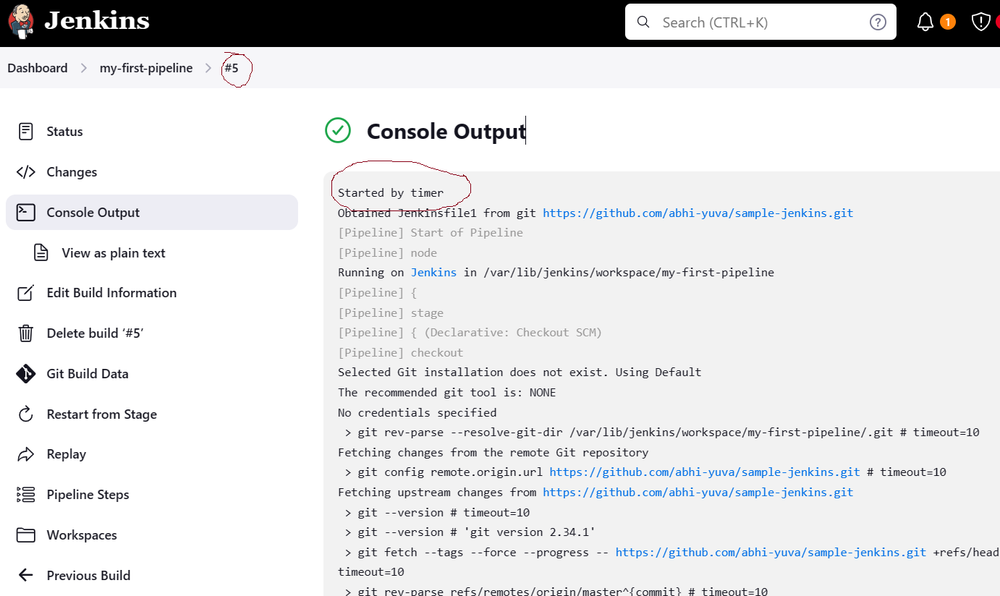
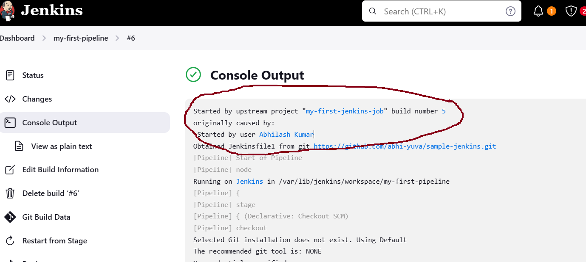

## jenkins Cont...

### How to Schedule a Job in Jenkins
- In jenkins to Schedule a Job we have 2 options
    1. **Build Periodically**
    2. **Pool SCM**

### **Build Periodically**
- With this option we can execute our jobs at a particualr period of time regularly.
- We have to put our data in the form of CornJob. It will have 5 option where you can choose as per your requirement.
- To do this, go to this [website](https://crontab.guru/) and then choose accordingly if you want to refer and confirm
- The 5 options are
    ```
    * * * * * 
    ```
    1. Minute - 0-59 Allowed
    2. Hours - 0-23 Allowed
    3. Day (Month) - 1-31
    4. Month - 1-12/JAN-DEC
    5. Day (Week) - 0-6/SUN-SAT

- In Jenkins the cornjob will be taken in Universal time zone.

### **Pool SCM**
- This is also similar to the Build Periodically option but the difference is that it will fetch the latest changes from the GitHub at particualr period of time
- To select this in configuration we have option called **pool SCM**



### How to Trigger one Job from another Job
- Our requirement is that we have two opton 
    * to execute a Job once other job or complted
    * to execute a job once this job is completed 
- These 2 options we call it as **Upstream Job & Downstream Job**
- Here is the sample how it looks like


- Here is the sample how it works once your open your console output you will be able to see that



