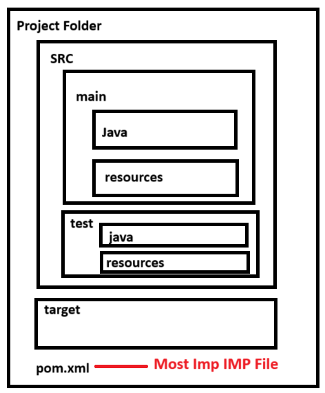

## Maven

- Maven is a build tool which is used to do package and deploy your packages
- For java applications we will be using maven as a build tool
- Maven Lifecyle will have several stages
1. **Validate** - Validate the structure and the informatio your provided is correct or not
2. **Complie** - Complie your Source Code
3. **test** - It will perform some unit test cases
4. **Package** - It will create a package according to your requ (Jar/War)
5. **Install** - It will install your packages in your local repository
6. **Deploy** - It will copy your packages in your remore repository
7. **Clean** - It will remove all the older packages and files from the target folder

- To create a source code/to do package your have to follow some folder structure
- All the dependencies related to your project will be written in a file called **POM.xml**
- POM is nothing but **Project Object Model**. 
- This POM.xml file will contain the following things
    1. Dependencies
    2. Plugins
    3. Goals
    4. Build Directory
    5. Source Directory
    6. Test Directory
- We have to follow the folder structre to create a source code

## How to Write POM.xml
- To write your pom.xml file below variables are common but the values may vary
    1. **modelVersion**
    2. **groupId**
    3. **artifactId**
    4. **version**
    5. **packaging**
```
<project xmlns="http://maven.apache.org/POM/4.0.0" 
        xmlns:xsi="http://www.w3.org/2001/XMLSchema-instance"
        xsi:schemaLocation="http://maven.apache.org/POM/4.0.0 http://maven.apache.org/maven-v4_0_0.xsd">

 <modelVersion>4.0.0</modelVersion>
 <groupId>com.mycompany.app</groupId>
 <artifactId>my-app</artifactId>
 <version>1</version>

</project>
```