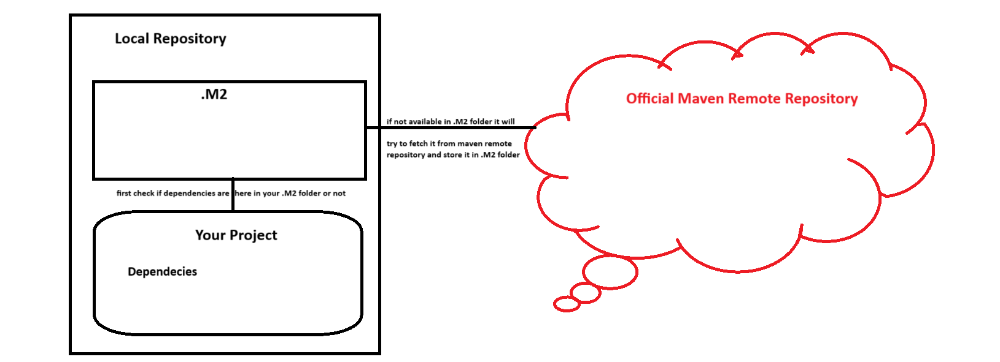

## Maven Cont...

- In Versioin where you are specifying in your POM.xml file it has 3 parts
    1. Major Version
    2. Minor Version
    3. Sub Minor Version
    ```
    Ex: 2.3.0
     2 - Major Version
     3 - Minor Version
     0 - Sub Minor Version
    ```

### Install Maven in Our Local System
- To install maven in your local system use the following command
```
choco install maven -y
```

- Now perform lifecycle steps
1. Validate `mvn validate`
```
$ mvn validate
[INFO] Scanning for projects...
[INFO] 
[INFO] ---------------------< com.java.app:my-maven-app >----------------------
[INFO] Building my-maven-app 1.0
[INFO] --------------------------------[ jar ]---------------------------------
[INFO] ------------------------------------------------------------------------
[INFO] BUILD SUCCESS
[INFO] ------------------------------------------------------------------------
[INFO] Total time:  0.086 s
[INFO] Finished at: 2024-03-29T06:53:52+05:30
[INFO] ------------------------------------------------------------------------
```

2. Compile `mvn compile`
```
$ mvn compile
[INFO] Scanning for projects...
[INFO] 
[INFO] ---------------------< com.java.app:my-maven-app >----------------------
[INFO] Building my-maven-app 1.0
[INFO] --------------------------------[ jar ]---------------------------------
[INFO] 
[INFO] --- maven-resources-plugin:2.6:resources (default-resources) @ my-maven-app ---
[WARNING] Using platform encoding (Cp1252 actually) to copy filtered resources, i.e. build is platform dependent!
[INFO] skip non existing resourceDirectory D:\Devops\Feb 2024\Classes\Git\Devops-Feb-2024\Jenkins\maven\src\main\resources
[INFO] Compiling 1 source file to D:\Devops\Feb 2024\Classes\Git\Devops-Feb-2024\Jenkins\maven\target\classes  
[INFO] ------------------------------------------------------------------------
[INFO] BUILD SUCCESS
[INFO] ------------------------------------------------------------------------
[INFO] Total time:  1.228 s
[INFO] Finished at: 2024-03-29T06:56:42+05:30
[INFO] ------------------------------------------------------------------------

```
- When ever you do `mvn complie` automatically a folder call *Target* will be created

3. Packaging `mvn package`
```
$ mvn package
[INFO] Scanning for projects...
[INFO] 
[INFO] ---------------------< com.java.app:my-maven-app >----------------------
[INFO] Building my-maven-app 1.0
[INFO] --------------------------------[ jar ]---------------------------------
[INFO] 
[INFO] --- maven-resources-plugin:2.6:resources (default-resources) @ my-maven-app ---
[WARNING] Using platform encoding (Cp1252 actually) to copy filtered resources, i.e. build is platform dependent!
[INFO] skip non existing resourceDirectory D:\Devops\Feb 2024\Classes\Git\Devops-Feb-2024\Jenkins\maven\src\main\resources
[INFO]
[INFO] --- maven-compiler-plugin:3.1:compile (default-compile) @ my-maven-app ---
[INFO] Changes detected - recompiling the module!
[WARNING] File encoding has not been set, using platform encoding Cp1252, i.e. build is platform dependent!
[INFO] Compiling 1 source file to D:\Devops\Feb 2024\Classes\Git\Devops-Feb-2024\Jenkins\maven\target\classes
[INFO] 
[INFO] --- maven-resources-plugin:2.6:testResources (default-testResources) @ my-maven-app ---   
[WARNING] Using platform encoding (Cp1252 actually) to copy filtered resources, i.e. build is platform dependent!
[INFO] skip non existing resourceDirectory D:\Devops\Feb 2024\Classes\Git\Devops-Feb-2024\Jenkins\maven\src\test\resources
[INFO]
[INFO] --- maven-compiler-plugin:3.1:testCompile (default-testCompile) @ my-maven-app ---        
[INFO] No sources to compile
[INFO]
[INFO] --- maven-surefire-plugin:2.12.4:test (default-test) @ my-maven-app ---
[INFO] No tests to run.
[INFO]
[INFO] --- maven-jar-plugin:2.4:jar (default-jar) @ my-maven-app ---
[INFO] Building jar: D:\Devops\Feb 2024\Classes\Git\Devops-Feb-2024\Jenkins\maven\target\my-maven-app-1.0.jar
[INFO] ------------------------------------------------------------------------
[INFO] BUILD SUCCESS
[INFO] ------------------------------------------------------------------------
[INFO] Total time:  1.264 s
[INFO] Finished at: 2024-03-29T07:00:51+05:30
[INFO] ------------------------------------------------------------------------
```
- When ever you do package it will create a package in the below fomat
**artifactID-versionID.packaging**

4. Clean `mvn clean`
```
$ mvn clean
[INFO] Scanning for projects...
[INFO] 
[INFO] ---------------------< com.java.app:my-maven-app >----------------------
[INFO] Building my-maven-app 1.0
[INFO] --------------------------------[ jar ]---------------------------------
[INFO] 
[INFO] --- maven-clean-plugin:2.5:clean (default-clean) @ my-maven-app ---
[INFO] Deleting D:\Devops\Feb 2024\Classes\Git\Devops-Feb-2024\Jenkins\maven\target
[INFO] ------------------------------------------------------------------------
[INFO] BUILD SUCCESS
[INFO] ------------------------------------------------------------------------
[INFO] Total time:  0.307 s
[INFO] Finished at: 2024-03-29T07:04:38+05:30
[INFO] ------------------------------------------------------------------------
```

## How Dependencies are used in our project
- When ever you install maven, it will try to create a folder called **.M2**
- This folder will act as a local maven repository for our projects
- It will store all the dependencies required to run our project
- The actual flow of process is as follows


