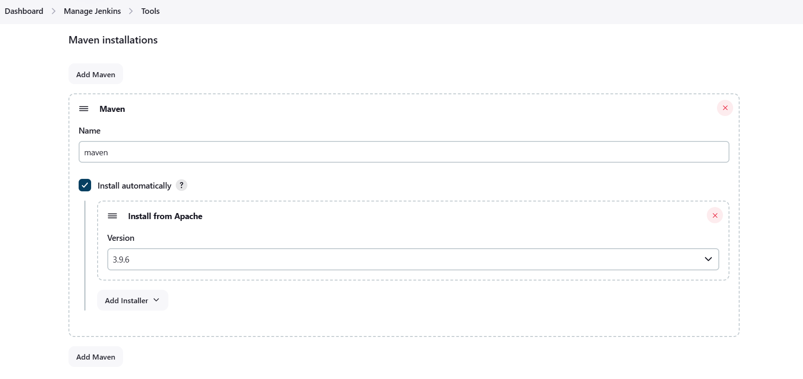
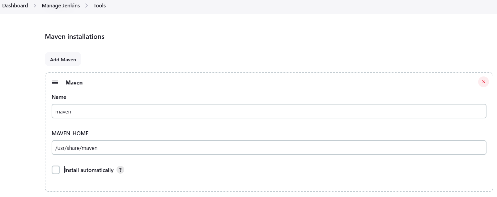
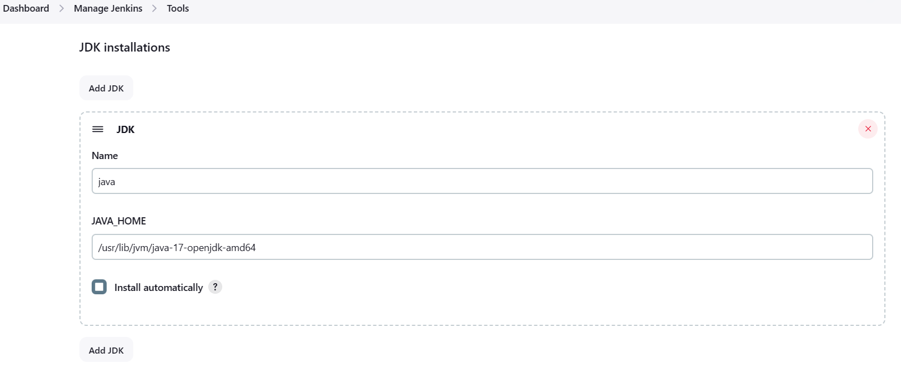
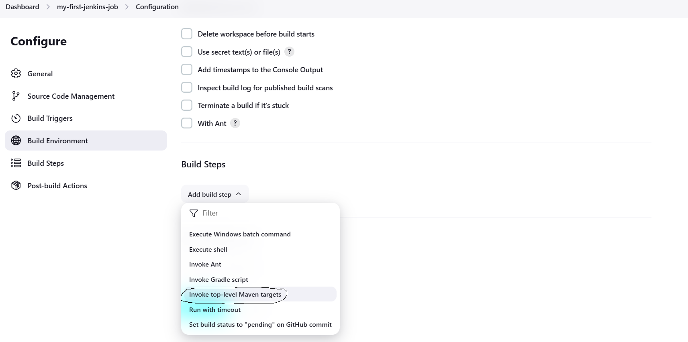
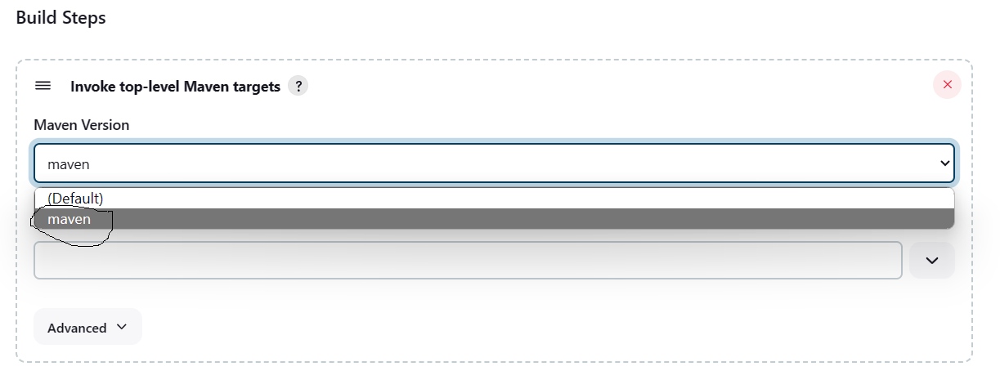
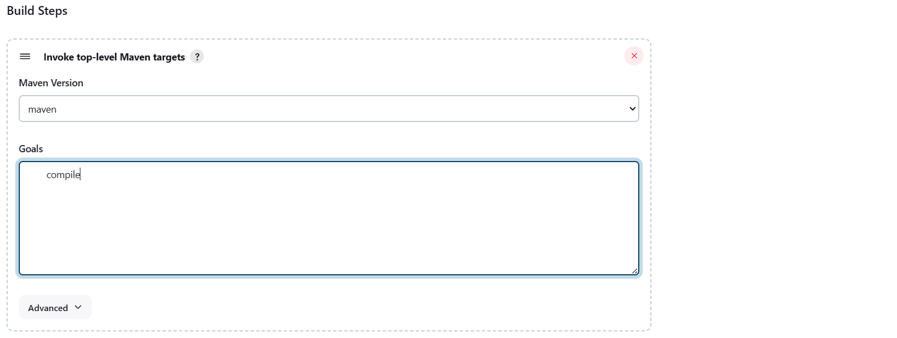

## Maven Cont...

### Install & Configure Maven in jenkins
- First step is to install maven
- To install Maven we can do it in 2 ways
    1. From the Jenkins Configurations
    2. Directly in the Server where ever jenkins is installed

### From the Jenkins Configurations
- Follow the below steps
    1. Go to Jenkins Dashboard
    2. Go to Manage Jenkins
    3. Select Tools
    4. Head to Maven Installation
    5. Give the name of the maven
    6. Select install Automatically
    7. Select the version to install
    8. Click on Apply & Save


### Directly in the Server where ever jenkins is installed
- connect to the server
- Type the following commands to install maven
```
sudo apt-get update
sudo apt install maven -y
```
- Once maven installed search for `mvn --version`
```
root@ip-172-31-21-172:/home/ubuntu# mvn --version
Apache Maven 3.6.3
Maven home: /usr/share/maven
Java version: 17.0.10, vendor: Private Build, runtime: /usr/lib/jvm/java-17-openjdk-amd64
Default locale: en, platform encoding: UTF-8
OS name: "linux", version: "6.5.0-1014-aws", arch: "amd64", family: "unix"
```
- Default location of maven is `/usr/share/maven`
- Default location of JDK is `/usr/lib/jvm/java-17-openjdk-amd64`
- Once you install Maven you have to configure your maven in jenkins
- Two things you have to configure 
    1. Maven
    
    2. JDK
    


### Create a Job in Jenkins to execute Maven Steps
- Go to jenkins Dashboard
- Create a New Job
- Under Build Steps select `invoke top-level Maven Targets`

- Then give maven steps
- Select the tool

- Under `Goals` you have to type your goals


- Follow the class recording to create a maven repo
- For sample Repo [Use This](https://github.com/abhi-yuva/my-maven-repo)
- Execute your Job