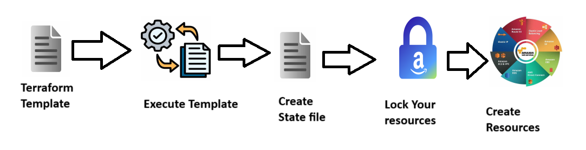

### How an infrastructure is Created
- Infrastructure is maintained in 4 ways
    1. Physical Machine
    2. Virtual Machines
    3. On-Premises
    4. Cloud Management
- To create infra we need to make sure what is our requirement(configuration of your system)
- Based on application usage and performance configuration may vary
- It is not common to all the infra

### Pre-requirements before creating your infrastrcture
- Here are some of the manul steps we will take to create infra
    1. Configuration
        * RAM
        * CPU
        * Memory(SSD)
        * Volume
        * Encryption
        * OS
        * Pre-installed softwares
    2. Where to Create
        * Physical/Virtual Machine
        * On-Premises
        * Cloud Environment

- Instead of performing all these manual steps is there any way to atomate this process?
- We have an option called Templates which will automate your manual steps to create infra
- This Automation process to create your infra is nothing but **IaC (Infrastructure as a Code)**
- We have to create template and then we have to execute that template to create infra
- The tool which is used for this IaC is **Terraform**

## Terraform
- Terraform is an open source Infra Provisioning tool to create and manage your infra
- By using Terraform we can create in any of the cloud environments
- By default all the cloud environments has there own template(IaC) to create infra
- Terraform is a third party tool which can be used to create this infra. It will support maximam all the cloud providers
- Major cloud providers in the market are
    1. AWS
    2. Azure
    3. GCP
    4. Openstack
    5. Alibaba
- Here are some of the default IaC provided by cloud providers
    1. AWS - [Cloud Formation](https://docs.aws.amazon.com/AWSCloudFormation/latest/UserGuide/Welcome.html)
    2. Azure - [ARM Templates](https://learn.microsoft.com/en-us/azure/azure-resource-manager/templates/overview)
    3. GCP

- Terraform was maintained by HashiCorp, it will support almost all the providers in the market
- [Official Docuementation](https://developer.hashicorp.com/terraform?product_intent=terraform) for Terraform

## How Terraform Works
- Follow the below steps to know how terraform works
    1. Create Template
    2. Execute Template
    3. It will try to create a file called **terraform-statefile**
    4. Lock the Resources
    5. Create the Resources
    6. Share the output


### Terminology in Terraform
- Here are some of the terms in Terraform
    1. Provider - Destination where you want your resources to be created
        * AWS
        * Azure
        * GCP
        * k8s
    2. Resources - What services you want to create
        * EC2 Machine
        * Security Group
        * VCP
        * S3 Bucket
    3. Module - Template
        * ec2
        * vpc
        * s3
        * security group
    4. Arguments - Inputs to the template
        * To create EC2 Machine in AWS
            * AMI
            * No of Instances
            * Security Group
            * Volume Size
            * Key-pair
    5. Attributes - Outpus
        * EC2 Machine
            * Instance ID
            * public IP
            * Privat IP

### Setup before starting with Terraform
1. Install Terraform in your local system
```
choco install terraform
```
2. Install AWS Cli
```
choco install awscli
```

