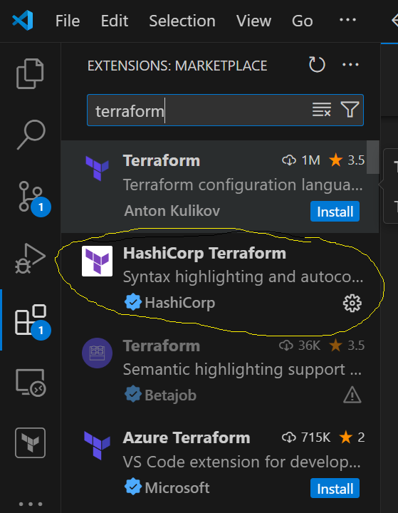
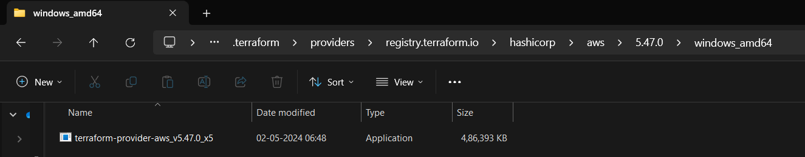

### Terraform Cont...
- There are 3 way to create any resources in providers
    1. From Console
    2. From CLI(Command Line Interface)
    3. From Third Party Tools

## Terraform Life Cycle
- Basically terraform will follow in 6 steps
    1. **Terraform Init** -  To initialize all the configuration we have to use this `terraform init`
    2. **Terraform format** - To make your code into perfect format. Short form is `terraform fmt`
    3. **Terrafrom validate** - To check for any syntatical errors `terraform validate`
    4. **Terraform plan** - To see what is going to be happen(create/change/delete) `terraform plan`
    5. **Terraform apply** - To create/change/delete resources in live `terraform apply`
    6. **Terraform destroy** - To remove/delete resources `terraform destroy`
> **Note:** When ever you want to create any resources through terraform, dont try to modify any resources directly in console, because it may refelct or get conflicts while performing from terraform next time. It is strictly recommended way to follow even in organization also.

## Terraform File Creation
- Before going to create terraform file make sure to support your content with autofill from VS Code. Install this extension in VS Code

- Terraform files will have the extension of **.tf** `main.tf`
- We need to follow some intendation while creating terraform files
- These are the block we have to follow
    1. [**Terraform**](https://developer.hashicorp.com/terraform/language/settings) - To control what kind of version you want to maintain in your code
    2. [**Provider**](https://registry.terraform.io/browse/providers?product_intent=terraform) - In which provider you want to create
    3. [**Resource**](https://developer.hashicorp.com/terraform/language/resources/syntax) - What are the services you want to create
    4. [**Data Source**](https://developer.hashicorp.com/terraform/language/data-sources) - Default content you want to pass as a data to resources. This block is inner block of resources
    5. [**Provisioners**](https://developer.hashicorp.com/terraform/language/resources/provisioners/syntax)

## Provider Syntax
- We have to follow some structe while creating any blocks
- A block can be identified with the help of Curly braces
```
{

}
```
- Provider block sysntax
```
provider "provider-name" {
    key1 = "value1"
    key2 = "value2"
}

provider "aws" {
    region = "us-west-2"
}
```

## Terraform configuration
- After creating your terraform file first step is youhave to do `terraform init`
- This will try to download the necessary configuration details and plugins that support the provider into your code automatically
- We no need to download externally
- As soon as you do terraform init it will try to create a folder call **.terraform** which will have all the details in it.
- Here is the output what it will try to create when you do `terraform init`
```
$ terraform init

Initializing the backend...

Initializing provider plugins...
- Finding latest version of hashicorp/aws...
- Installing hashicorp/aws v5.47.0...
- Installed hashicorp/aws v5.47.0 (signed by HashiCorp)

Terraform has created a lock file .terraform.lock.hcl to record the provider
selections it made above. Include this file in your version control repository
so that Terraform can guarantee to make the same selections by default when
you run "terraform init" in the future.

Terraform has been successfully initialized!

You may now begin working with Terraform. Try running "terraform plan" to see
any changes that are required for your infrastructure. All Terraform commands
should now work.

If you ever set or change modules or backend configuration for Terraform,
rerun this command to reinitialize your working directory. If you forget, other
commands will detect it and remind you to do so if necessary.
```



