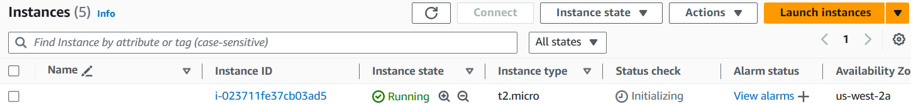

### Terraform Cont...

## How to create IAM Role
- Follow Class recording to create IAM Role
- Note down the Access Key & Secrety Access key

## Configure AWS credentials in Terraform
- When you want to create any resources we need to know where you have to create?
- You need to have connectivity between Thirdy Party tool & AWS
- In AWS we have an option called IAM(Identity & Access Management)
- Use the Access keys which was created earlier and follow the below steps
- In provider block we have to pass these values
```
provider "aws" {
    region = "us-west-2"
    access_key = "<your-access-key>"
    secret_key = "<your-secret-key>"
}
```

## How to write Resorce Block for EC2 Creation
- Resource block will contain the actual data which is used to create services in providers
- Before writing this we need to know what are the manual steps that are required to create a service
- Below are the manual steps to create EC2 Machine
    1. Choose AMI
    2. Instance Type
    3. Key-Pair
    4. Security Groups
    5. Volume/Storage
    6. Name of the EC2 Machine
    7. No of Instances to Create
- Now convert all these manual steps into automation in terraform
- Syntax of Resource block is
```
resource "aws_instance" "my-ec2" {
    ami = "ami-0cf2b4e024cdb6960"
    instance_type = "t2.micro"

    tags = {
      name = "Through Terraform"
    } 
}

```
- After that follow the commands
```
terraform fmt
terraform validate
terraform plan
```
- Here is the sample plan output
```
$ terraform plan

Terraform used the selected providers to generate the following execution plan. Resource actions are
indicated with the following symbols:
  + create

Terraform will perform the following actions:

  # aws_instance.my-ec2 will be created
  + resource "aws_instance" "my-ec2" {
      + ami                                  = "ami-0cf2b4e024cdb6960"
      + arn                                  = (known after apply)
      + associate_public_ip_address          = (known after apply)
      + availability_zone                    = (known after apply)
      + cpu_core_count                       = (known after apply)
      + cpu_threads_per_core                 = (known after apply)
      + disable_api_stop                     = (known after apply)
      + disable_api_termination              = (known after apply)
      + ebs_optimized                        = (known after apply)
      + get_password_data                    = false
      + host_id                              = (known after apply)
      + host_resource_group_arn              = (known after apply)
      + iam_instance_profile                 = (known after apply)
      + id                                   = (known after apply)
      + instance_initiated_shutdown_behavior = (known after apply)
      + instance_lifecycle                   = (known after apply)
      + instance_state                       = (known after apply)
      + instance_type                        = "t2.micro"
      + ipv6_address_count                   = (known after apply)
      + ipv6_addresses                       = (known after apply)
      + key_name                             = (known after apply)
      + monitoring                           = (known after apply)
      + outpost_arn                          = (known after apply)
      + password_data                        = (known after apply)
      + placement_group                      = (known after apply)
      + placement_partition_number           = (known after apply)
      + primary_network_interface_id         = (known after apply)
      + private_dns                          = (known after apply)
      + private_ip                           = (known after apply)
      + public_dns                           = (known after apply)
      + public_ip                            = (known after apply)
      + secondary_private_ips                = (known after apply)
      + security_groups                      = (known after apply)
      + source_dest_check                    = true
      + spot_instance_request_id             = (known after apply)
      + subnet_id                            = (known after apply)
      + tags                                 = {
          + "name" = "Through Terraform"
        }
      + tags_all                             = {
          + "name" = "Through Terraform"
        }
      + tenancy                              = (known after apply)
      + user_data                            = (known after apply)
      + user_data_base64                     = (known after apply)
      + user_data_replace_on_change          = false
      + vpc_security_group_ids               = (known after apply)
    }

Plan: 1 to add, 0 to change, 0 to destroy.

────────────────────────────────────────────────────────────────────────────────────────────────────── 

Note: You didn't use the -out option to save this plan, so Terraform can't guarantee to take exactly   
these actions if you run "terraform apply" now.
```
- Then do apply to create resource & it will ask you for confirmation, give yes to create resources
```
terraform apply
```
```
Do you want to perform these actions?
  Terraform will perform the actions described above.
  Only 'yes' will be accepted to approve.

  Enter a value: yes
```
- Then after creation it will show you ID. Here is sample output
```
aws_instance.my-ec2: Creating...
aws_instance.my-ec2: Still creating... [10s elapsed]
aws_instance.my-ec2: Still creating... [20s elapsed]
aws_instance.my-ec2: Still creating... [30s elapsed]
aws_instance.my-ec2: Still creating... [40s elapsed]
aws_instance.my-ec2: Still creating... [50s elapsed]
aws_instance.my-ec2: Creation complete after 58s [id=i-023711fe37cb03ad5]

Apply complete! Resources: 1 added, 0 changed, 0 destroyed.
```

- If you change any values in your code and if your perform plan or apply it will show you the difference and you can review and give permission to process
```
Terraform used the selected providers to generate the following execution plan. Resource actions are
indicated with the following symbols:
  ~ update in-place

Terraform will perform the following actions:

  # aws_instance.my-ec2 will be updated in-place
  ~ resource "aws_instance" "my-ec2" {
        id                                   = "i-023711fe37cb03ad5"
      ~ tags                                 = {
          ~ "Name" = "Terraform" -> "Through Terraform"
          - "name" = "Through Terraform" -> null
        }
      ~ tags_all                             = {
          ~ "Name" = "Terraform" -> "Through Terraform"
          - "name" = "Through Terraform" -> null
        }
        # (30 unchanged attributes hidden)

        # (8 unchanged blocks hidden)
    }
```
- Do terraform Destory will destory all the resources we have created use this command `terraform destroy`
- here is sample output
```
$ terraform apply
aws_instance.my-ec2: Refreshing state... [id=i-023711fe37cb03ad5]

Terraform used the selected providers to generate the following execution plan. Resource actions are
indicated with the following symbols:
  ~ update in-place

Terraform will perform the following actions:

  # aws_instance.my-ec2 will be updated in-place
  ~ resource "aws_instance" "my-ec2" {
        id                                   = "i-023711fe37cb03ad5"
      ~ tags                                 = {
          ~ "Name" = "Terraform" -> "Through Terraform"
          - "name" = "Through Terraform" -> null
        }
      ~ tags_all                             = {
          ~ "Name" = "Terraform" -> "Through Terraform"
          - "name" = "Through Terraform" -> null
        }
        # (30 unchanged attributes hidden)

        # (8 unchanged blocks hidden)
    }

Plan: 0 to add, 1 to change, 0 to destroy.

Do you want to perform these actions?
  Terraform will perform the actions described above.
  Only 'yes' will be accepted to approve.

  Enter a value: yes

aws_instance.my-ec2: Modifying... [id=i-023711fe37cb03ad5]
aws_instance.my-ec2: Modifications complete after 5s [id=i-023711fe37cb03ad5]

Apply complete! Resources: 0 added, 1 changed, 0 destroyed.

itsme@LAPTOP-F6GRUADQ MINGW64 /d/Devops/Devops-Practic/practice-terraform/sample-terraform (main)      
$ terraform destroy
aws_instance.my-ec2: Refreshing state... [id=i-023711fe37cb03ad5]

Terraform used the selected providers to generate the following execution plan. Resource actions are
indicated with the following symbols:
  - destroy

Terraform will perform the following actions:

  # aws_instance.my-ec2 will be destroyed
  - resource "aws_instance" "my-ec2" {
      - ami                                  = "ami-0cf2b4e024cdb6960" -> null
      - arn                                  = "arn:aws:ec2:us-west-2:880693540041:instance/i-023711fe37cb03ad5" -> null
      - associate_public_ip_address          = true -> null
      - availability_zone                    = "us-west-2a" -> null
      - cpu_core_count                       = 1 -> null
      - cpu_threads_per_core                 = 1 -> null
      - disable_api_stop                     = false -> null
      - disable_api_termination              = false -> null
      - ebs_optimized                        = false -> null
      - get_password_data                    = false -> null
      - hibernation                          = false -> null
      - id                                   = "i-023711fe37cb03ad5" -> null
      - instance_initiated_shutdown_behavior = "stop" -> null
      - instance_state                       = "running" -> null
      - instance_type                        = "t2.micro" -> null
      - ipv6_address_count                   = 0 -> null
      - ipv6_addresses                       = [] -> null
      - monitoring                           = false -> null
      - placement_partition_number           = 0 -> null
      - primary_network_interface_id         = "eni-0057d234cbf7e522d" -> null
      - private_dns                          = "ip-172-31-22-50.us-west-2.compute.internal" -> null    
      - private_ip                           = "172.31.22.50" -> null
      - public_dns                           = "ec2-35-94-116-197.us-west-2.compute.amazonaws.com" -> null
      - public_ip                            = "35.94.116.197" -> null
      - secondary_private_ips                = [] -> null
      - security_groups                      = [
          - "default",
        ] -> null
      - source_dest_check                    = true -> null
      - subnet_id                            = "subnet-0bd5369c96ef3e6a6" -> null
      - tags                                 = {
          - "Name" = "Through Terraform"
        } -> null
      - tags_all                             = {
          - "Name" = "Through Terraform"
        } -> null
      - tenancy                              = "default" -> null
      - user_data_replace_on_change          = false -> null
      - vpc_security_group_ids               = [
          - "sg-08ac779c1bf102ceb",
        ] -> null

      - capacity_reservation_specification {
          - capacity_reservation_preference = "open" -> null
        }

      - cpu_options {
          - core_count       = 1 -> null
          - threads_per_core = 1 -> null
        }

      - credit_specification {
          - cpu_credits = "standard" -> null
        }

      - enclave_options {
          - enabled = false -> null
        }

      - maintenance_options {
          - auto_recovery = "default" -> null
        }

      - metadata_options {
          - http_endpoint               = "enabled" -> null
          - http_protocol_ipv6          = "disabled" -> null
          - http_put_response_hop_limit = 2 -> null
          - http_tokens                 = "required" -> null
          - instance_metadata_tags      = "disabled" -> null
        }

      - private_dns_name_options {
          - enable_resource_name_dns_a_record    = false -> null
          - enable_resource_name_dns_aaaa_record = false -> null
          - hostname_type                        = "ip-name" -> null
        }

      - root_block_device {
          - delete_on_termination = true -> null
          - device_name           = "/dev/sda1" -> null
          - encrypted             = false -> null
          - iops                  = 3000 -> null
          - tags                  = {} -> null
          - tags_all              = {} -> null
          - throughput            = 125 -> null
          - volume_id             = "vol-034a50b68280143c3" -> null
          - volume_size           = 8 -> null
          - volume_type           = "gp3" -> null
        }
    }

Plan: 0 to add, 0 to change, 1 to destroy.

Do you really want to destroy all resources?
  Terraform will destroy all your managed infrastructure, as shown above.
  There is no undo. Only 'yes' will be accepted to confirm.

  Enter a value: yes

aws_instance.my-ec2: Destroying... [id=i-023711fe37cb03ad5]
aws_instance.my-ec2: Still destroying... [id=i-023711fe37cb03ad5, 10s elapsed]
aws_instance.my-ec2: Still destroying... [id=i-023711fe37cb03ad5, 20s elapsed]
aws_instance.my-ec2: Still destroying... [id=i-023711fe37cb03ad5, 30s elapsed]
aws_instance.my-ec2: Still destroying... [id=i-023711fe37cb03ad5, 40s elapsed]
aws_instance.my-ec2: Still destroying... [id=i-023711fe37cb03ad5, 50s elapsed]
aws_instance.my-ec2: Still destroying... [id=i-023711fe37cb03ad5, 1m0s elapsed]
aws_instance.my-ec2: Still destroying... [id=i-023711fe37cb03ad5, 1m10s elapsed]
aws_instance.my-ec2: Still destroying... [id=i-023711fe37cb03ad5, 1m20s elapsed]
aws_instance.my-ec2: Still destroying... [id=i-023711fe37cb03ad5, 1m30s elapsed]
aws_instance.my-ec2: Still destroying... [id=i-023711fe37cb03ad5, 1m40s elapsed]
aws_instance.my-ec2: Still destroying... [id=i-023711fe37cb03ad5, 1m50s elapsed]
aws_instance.my-ec2: Still destroying... [id=i-023711fe37cb03ad5, 2m0s elapsed]
aws_instance.my-ec2: Still destroying... [id=i-023711fe37cb03ad5, 2m10s elapsed]
aws_instance.my-ec2: Still destroying... [id=i-023711fe37cb03ad5, 2m20s elapsed]
aws_instance.my-ec2: Destruction complete after 2m27s

Destroy complete! Resources: 1 destroyed.
```
