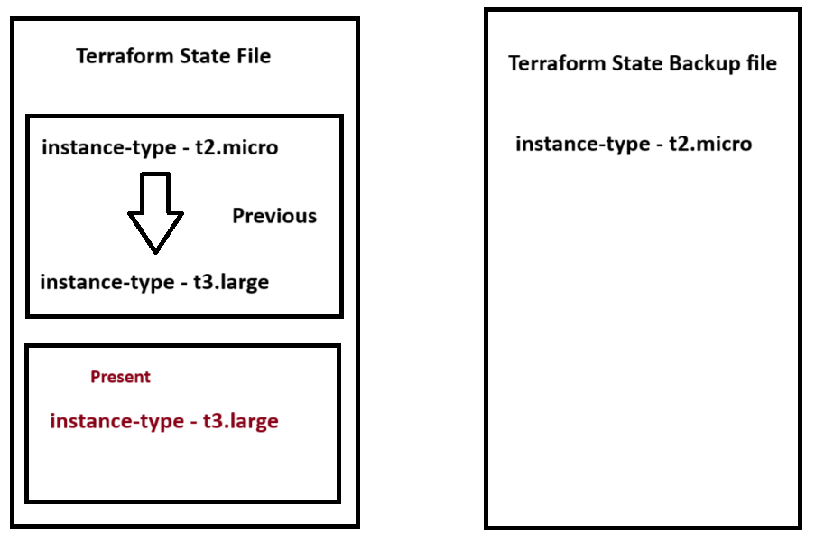

## Terraform Cont...
- After creation of bucket here is sample output
```
aws_s3_bucket.my-bucket: Creating...
aws_s3_bucket.my-bucket: Creation complete after 6s [id=abhi-backend-bucket]

Apply complete! Resources: 1 added, 0 changed, 0 destroyed.

Outputs:

bucket-name = "abhi-backend-bucket"
```
- Now we have to initialize our state files with the backend configuration
- For that we have to type `terraform init` again to do backend configuration
- When executing the `init` it will ask you to copy any existing state file data if you want you can proceed or you can ignore
```
$ terraform init

Initializing the backend...
Do you want to copy existing state to the new backend?
  Pre-existing state was found while migrating the previous "local" backend to the
  newly configured "s3" backend. No existing state was found in the newly
  configured "s3" backend. Do you want to copy this state to the new "s3"
  backend? Enter "yes" to copy and "no" to start with an empty state.

  Enter a value: 
```
- Once the intialization is completed you can go and check in your bucket you will be able to see the path that is created for backend
- here is sample output
